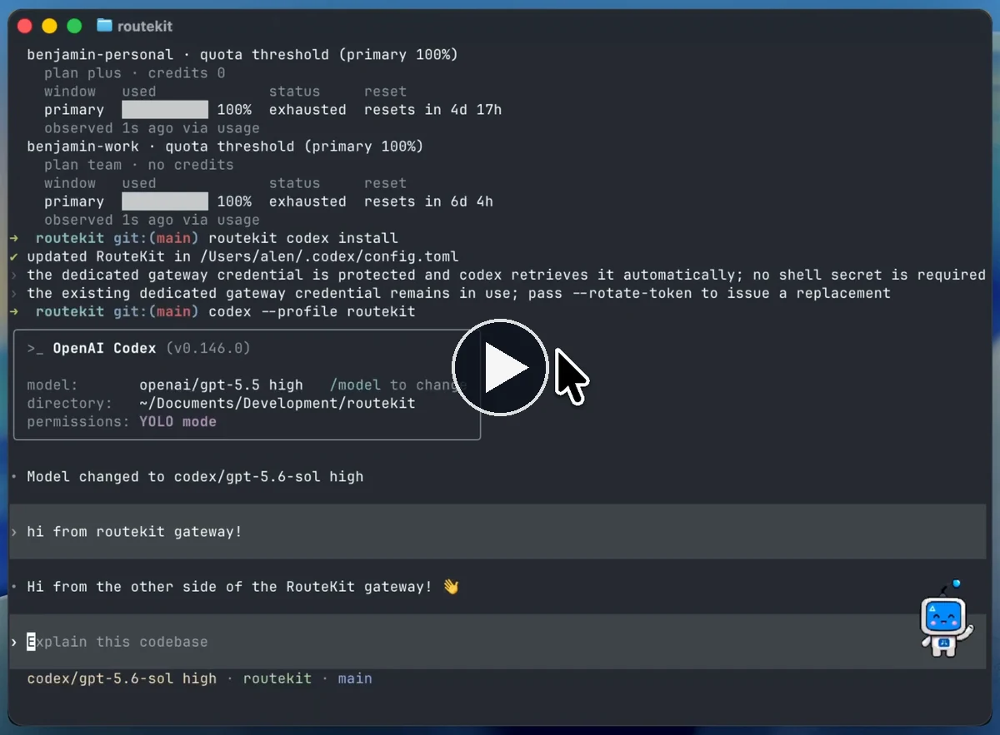
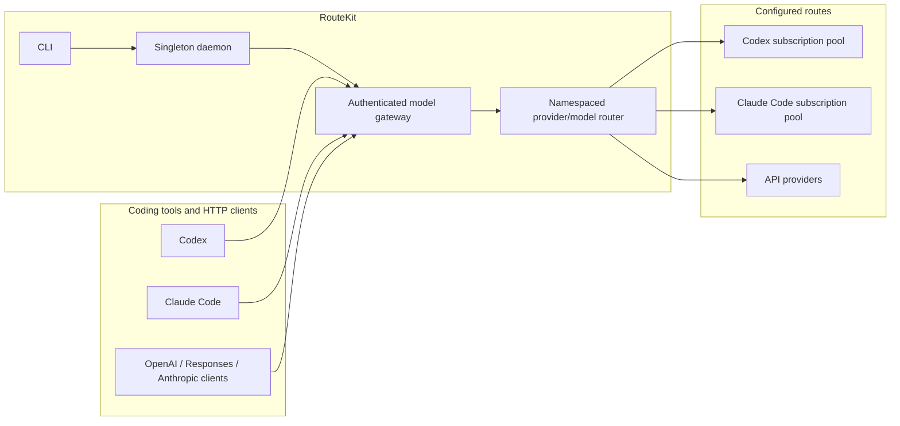

# RouteKit

One gateway for your coding subscriptions and model providers.

RouteKit is an open-source CLI and authenticated model gateway for coding
agents. Connect Codex and Claude Code subscriptions or API providers, discover
the models they can serve, and use those routes from supported coding tools or
compatible HTTP clients.

- **Use models across tools.** Switch routes from the native model picker, or
  pin one exact `provider/model` when a run must be deterministic.
- **Pool subscription accounts.** Route across eligible Codex or Claude Code
  accounts of the same kind.
- **Connect API providers.** Use OpenAI, Anthropic, OpenRouter, Amazon Bedrock,
  and other configured routes behind one stable gateway.
- **See what happened.** Inspect model, provider, account, usage, and cost
  attribution for individual calls.

[Documentation](https://routekit.velum-labs.com/docs) ·
[Installation](https://routekit.velum-labs.com/docs/getting-started/installation) ·
[User guide](https://routekit.velum-labs.com/docs/guides/user-guide) ·
[CLI reference](https://routekit.velum-labs.com/docs/reference/commands) ·
[Security](SECURITY.md)

<p align="center">
  <a href="https://routekit-docs-velum-labs.vercel.app/assets/demo.mp4">
    
  </a>
</p>

<p align="center">
  <sub>Watch RouteKit switch models and route a Codex session through the gateway.</sub>
</p>

## Why RouteKit

Coding agents increasingly support multiple model backends, but each tool has
its own configuration, model names, credentials, and account state. Switching
tools or providers often means rebuilding that setup.

RouteKit puts one local control plane and authenticated gateway in the middle:

- configure providers and subscription accounts once;
- discover canonical, namespaced model IDs;
- launch Codex or Claude Code against a selected route;
- point OpenAI-, Responses-, or Anthropic-compatible clients at the same
  gateway; and
- inspect which provider and account handled a request.

## Quickstart

RouteKit supports macOS and Linux. If Node.js 22 or newer is installed:

```sh
npm install -g @velum-labs/routekit
routekit setup
routekit status
```

`routekit setup` walks through the routes you want to connect, validates API
providers, enrolls selected subscriptions, starts the daemon, and asks you to
choose a default model. API keys stay in environment variables; RouteKit does
not prompt for or store them.

Launch your preferred coding tool from any project:

```sh
cd ~/code/my-project

routekit codex
routekit claude
```

RouteKit opens the native coding tool in the current directory and connects it
to the gateway. The session starts with a suitable model, and the compatible
RouteKit catalog is available in the tool's native model picker. Switch models
inside the tool instead of restarting it or copying an ID for every launch.

To force the startup model for one session:

```sh
routekit codex openai/gpt-5.5
routekit claude claude-code/claude-sonnet-4-6
```

Use `routekit models list` when you want to inspect the catalog, troubleshoot a
route, or copy an exact model ID for a deterministic command.

Headless setup is available with `routekit setup --no-browser`. For deterministic
or automated configuration, see the
[installation guide](https://routekit.velum-labs.com/docs/getting-started/installation).

## What you can connect

### Subscription accounts

Enroll one or more accounts from either supported subscription kind:

```sh
routekit config init --empty
routekit accounts login codex --name personal
routekit accounts login codex --name work
routekit accounts login claude-code --name team

routekit accounts status
routekit usage
```

RouteKit discovers model eligibility and selects an available account from the
matching pool.

### API providers

The guided setup supports OpenAI, Anthropic, OpenRouter, and Amazon Bedrock.
For automation, initialize a provider directly:

```sh
export ANTHROPIC_API_KEY='your-key'
routekit config init --provider anthropic
routekit providers status
routekit models list --provider anthropic
```

### Coding tools

From a project directory, launch Codex or Claude Code and choose among
compatible RouteKit models from the native picker:

```sh
routekit codex
routekit claude
```

Pass an exact `provider/model` only when you need to control the startup model
for a one-off comparison, script, or reproducible run.

Or install persistent, additive RouteKit configuration into the native clients:

```sh
routekit codex install
routekit claude install
```

The installers preserve existing client configuration, MCPs, skills, plugins,
and native history. Check the
[client compatibility matrix](https://routekit.velum-labs.com/docs/reference/client-compatibility)
for currently qualified versions.

### HTTP clients

RouteKit exposes authenticated OpenAI Chat Completions, OpenAI Responses, and
Anthropic Messages endpoints. It also publishes a live model catalog.

```sh
ROUTEKIT_URL='http://127.0.0.1:8080'
ROUTEKIT_TOKEN="$(routekit daemon auth show)"

curl -sS "$ROUTEKIT_URL/v1/models" \
  -H "Authorization: Bearer $ROUTEKIT_TOKEN"
```

`routekit daemon auth show` prints the private owner token. Do not paste it into
logs or source control. Issue a named data-plane token for another user or
application:

```sh
routekit token issue <label>
```

See the
[HTTP gateway walkthrough](https://routekit.velum-labs.com/docs/guides/user-guide#call-the-http-gateway-directly)
for request examples.

## How it works



One singleton daemon per `ROUTEKIT_HOME` owns provider discovery, subscription
pools, usage, call attribution, and the canonical router configuration. The
gateway listens on `127.0.0.1:8080` by default, while the CLI manages it through
a separate local control plane.

The canonical configuration is:

```text
~/.config/routekit/router.yaml
```

## Inspect a routed call

Model responses include an `x-routekit-model-call-id` header. Use it to inspect
the route that handled the request:

```sh
routekit calls inspect <call-id>
```

The inspection reports the effective and provider-native model, provider,
billing mode, retries, usage, cost when known, and account attribution without
storing prompt or response text.

## Common commands

| Command | Purpose |
| --- | --- |
| `routekit setup` | Configure API and subscription routes interactively. |
| `routekit status` | Show daemon, gateway, provider, account, and model status. |
| `routekit models list` | List discovered namespaced model IDs. |
| `routekit models info <provider/model>` | Inspect one advertised route. |
| `routekit accounts status` | Inspect enrolled subscription accounts. |
| `routekit usage` | Show available subscription usage and reset data. |
| `routekit codex [provider/model]` | Launch Codex; optionally pin its startup model. |
| `routekit claude [provider/model]` | Launch Claude Code; optionally pin its startup model. |
| `routekit calls inspect <call-id>` | Inspect routing and usage attribution. |
| `routekit doctor` | Diagnose configuration and runtime problems. |
| `routekit self-update` | Update the installed CLI. |

## Documentation

- [Installation](https://routekit.velum-labs.com/docs/getting-started/installation)
- [Complete user guide](https://routekit.velum-labs.com/docs/guides/user-guide)
- [Subscription pooling](https://routekit.velum-labs.com/docs/guides/subscription-pooling)
- [Client compatibility](https://routekit.velum-labs.com/docs/reference/client-compatibility)
- [Model catalog](https://routekit.velum-labs.com/docs/reference/model-catalog)
- [Configuration](https://routekit.velum-labs.com/docs/reference/configuration)
- [Privacy](https://routekit.velum-labs.com/docs/concepts/privacy)
- [CLI commands](https://routekit.velum-labs.com/docs/reference/commands)
- [Agent-readable guide](https://routekit.velum-labs.com/docs/getting-started/agent-guide.md)

## Develop from source

RouteKit is a TypeScript pnpm/Turborepo monorepo. It requires Node.js 22.19 or
newer and uses pnpm 11.15.1 through Corepack.

```sh
corepack enable
pnpm install --frozen-lockfile
pnpm check
pnpm build
pnpm test
```

Useful focused commands:

```sh
pnpm build:cli
pnpm dev:link-routekit
pnpm docs:dev
pnpm docs:build
pnpm verify
```

`pnpm dev:link-routekit` installs a separate `routekit-dev` command that runs
this checkout without replacing the published `routekit` binary.

## Repository map

- `packages/cli` — published CLI and `routekit` executable
- `packages/daemon` — singleton daemon and lifecycle
- `packages/gateway` — authenticated model gateway and protocol adapters
- `packages/router` — reusable route composition
- `packages/accounts` — subscription enrollment, eligibility, and account state
- `packages/tool-*` — coding-tool integration boundaries
- `apps/docs` — public documentation website
- `docs` — maintainer documentation and qualification evidence

## Security

Report vulnerabilities privately through GitHub Security Advisories. Do not
open public issues containing vulnerabilities, credentials, or tokens.

See [SECURITY.md](SECURITY.md) for details.

## License

RouteKit is licensed under the [Apache License 2.0](LICENSE).
