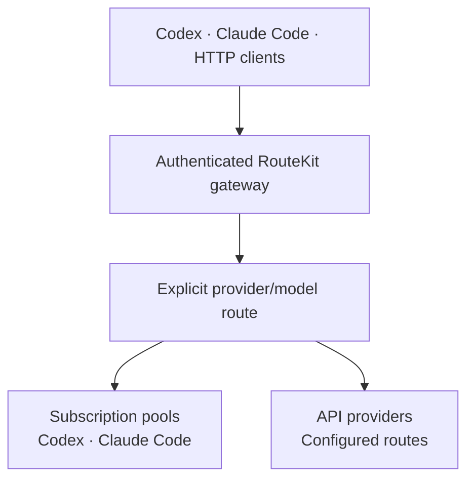

# RouteKit

One gateway for your coding subscriptions and model providers.

RouteKit is an open-source CLI and authenticated local model gateway. Pool
Codex or Claude Code subscriptions, connect API providers, and use discovered
models from supported coding tools or compatible HTTP clients.

- **Pool subscriptions.** Route across eligible accounts of the same kind.
- **Use models across tools.** Launch supported routes from Codex or Claude Code.
- **Connect API providers.** Add OpenAI, Anthropic, OpenRouter, and other
  configured routes.
- **Keep routing explicit.** Every model stays attached to its provider,
  credential, quota, and billing path.

[Documentation](https://routekit.velum-labs.com/docs) ·
[Quickstart](https://routekit.velum-labs.com/docs/getting-started/quickstart) ·
[CLI reference](https://routekit.velum-labs.com/docs/reference/commands) ·
[Security](SECURITY.md)

## Quickstart

RouteKit supports macOS and Linux. Install the self-contained CLI:

```sh
curl -fsSL https://github.com/velum-labs/routekit/releases/download/routekit-latest/install.sh | sh
routekit version
```

Connect your subscriptions or API providers:

```sh
routekit setup
```

Verify the gateway and inspect the models available to you:

```sh
routekit status
routekit models list
```

Copy one exact `provider/model` ID and use it from a supported coding tool:

```sh
routekit codex <provider/model>
# or
routekit claude <provider/model>
```

If Node.js 22.22 or newer is already installed, you can use npm instead:

```sh
npm install -g @velum-labs/routekit
```

## Subscription pooling

Enroll multiple Codex or Claude Code accounts:

```sh
routekit accounts login codex --name personal
routekit accounts login codex --name work

routekit accounts status
routekit usage
```

RouteKit discovers which models each account can serve and selects only among
eligible accounts for the requested model.

Failover remains inside the same subscription kind. An unavailable subscription
route never silently invokes another provider or a metered API-key route.

Read the
[subscription pooling guide](https://routekit.velum-labs.com/docs/guides/subscription-pooling)
for account selection, quotas, cooldowns, and recovery.

## Use models across coding tools

RouteKit exposes explicit namespaced model IDs:

```text
openai/<model>
anthropic/<model>
openrouter/<model>
codex/<model>
claude-code/<model>
```

Use only IDs returned by `routekit models list`.

```sh
routekit codex <provider/model>
routekit claude <provider/model>
```

You can also install persistent RouteKit configuration for supported clients:

```sh
routekit codex install
routekit claude install
```

See
[coding-tool integration](https://routekit.velum-labs.com/docs/guides/coding-tools)
and
[supported client versions](https://routekit.velum-labs.com/docs/reference/client-compatibility)
for the qualified workflows.

## Use the HTTP gateway

RouteKit exposes authenticated OpenAI-, Responses-, and Anthropic-compatible
HTTP endpoints.

```sh
ROUTEKIT_URL="http://127.0.0.1:8080"
ROUTEKIT_TOKEN="$(routekit daemon auth show)"

curl -sS "$ROUTEKIT_URL/v1/models" \
  -H "Authorization: Bearer $ROUTEKIT_TOKEN"
```

Issue a named token for another user or application instead of sharing the
private owner token:

```sh
routekit token issue <label>
```

See the
[HTTP gateway guide](https://routekit.velum-labs.com/docs/guides/http-gateway)
for supported endpoints and request examples.

## How it works



One singleton daemon manages:

- provider authentication and model discovery;
- subscription accounts, quotas, and eligibility;
- the canonical router configuration;
- the authenticated local gateway; and
- usage and request attribution.

Configuration lives at:

```text
~/.config/routekit/router.yaml
```

The gateway binds to `127.0.0.1:8080` by default and requires authentication.

RouteKit does not promise unlimited usage. Provider terms, subscription
eligibility, quotas, rate limits, and billing still apply.

## Common commands

| Command | Purpose |
| --- | --- |
| `routekit setup` | Connect and verify subscriptions and API providers. |
| `routekit status` | Show daemon health and the gateway URL. |
| `routekit models list` | List discovered model IDs. |
| `routekit models info <provider/model>` | Explain a route and its billing class. |
| `routekit accounts status` | Inspect subscription account health. |
| `routekit usage` | Show subscription quota and reset information. |
| `routekit codex <provider/model>` | Launch Codex through RouteKit. |
| `routekit claude <provider/model>` | Launch Claude Code through RouteKit. |
| `routekit doctor` | Diagnose configuration and runtime problems. |
| `routekit self-update` | Update the installed CLI. |

See the
[CLI reference](https://routekit.velum-labs.com/docs/reference/commands)
for complete syntax and automation options.

## Documentation

- [Quickstart](https://routekit.velum-labs.com/docs/getting-started/quickstart)
- [Installation](https://routekit.velum-labs.com/docs/getting-started/installation)
- [Subscription pooling](https://routekit.velum-labs.com/docs/guides/subscription-pooling)
- [Coding-tool integration](https://routekit.velum-labs.com/docs/guides/coding-tools)
- [Architecture](https://routekit.velum-labs.com/docs/concepts/architecture)
- [Configuration](https://routekit.velum-labs.com/docs/reference/configuration)
- [Troubleshooting](https://routekit.velum-labs.com/docs/guides/troubleshooting)
- [Agent guide](https://routekit.velum-labs.com/docs/getting-started/agent-guide.md)

## Develop from source

RouteKit is a TypeScript pnpm/Turborepo monorepo.

Requirements:

- Node.js 22.22 or newer
- pnpm 11.15.1 through Corepack

```sh
corepack enable
pnpm install --frozen-lockfile

pnpm check
pnpm build
pnpm test
```

Useful commands:

```sh
pnpm build:cli
pnpm dev:link-routekit
pnpm docs:dev
pnpm docs:build
pnpm verify
```

`pnpm dev:link-routekit` installs a separate `routekit-dev` executable without
replacing the published `routekit` command.

## Repository map

- `packages/cli` — published CLI and executable
- `packages/daemon` — singleton daemon and lifecycle
- `packages/gateway` — authenticated model gateway
- `packages/router` — provider and model routing
- `packages/accounts` — subscription enrollment and account state
- `packages/tool-*` — coding-tool integrations
- `apps/docs` — public documentation website
- `docs` — maintainer documentation and qualification evidence

## Security

Report vulnerabilities privately through GitHub Security Advisories. Do not
open public issues containing vulnerabilities, credentials, or tokens.

See [SECURITY.md](SECURITY.md) for details.

## License

RouteKit is licensed under the [Apache License 2.0](LICENSE).
