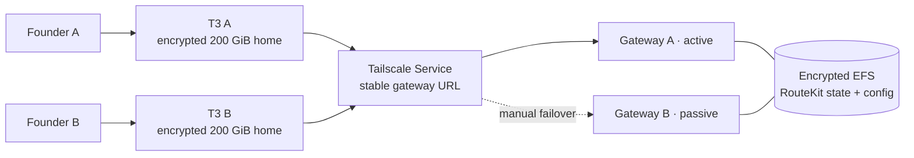

# RouteKit production on AWS

This directory is the public, secret-free deployment for two manually fenced
RouteKit gateways and a variable-length map of owner-specific T3 hosts in
`us-west-2`. The example and initial live deployment use two T3 entries.



The instances have public addresses only for outbound internet access. Their
EC2 security groups have no ingress. Administration, T3 HTTPS, and the gateway
HTTPS service are private Tailscale paths; SSM is the break-glass channel.

Terraform never receives a RouteKit token, provider credential, Tailscale auth
key, or Tailscale API credential. Tailscale client IDs and audiences are
nonsecret workload identity identifiers.

## Pinned release contract

| Component | Initial version |
| --- | --- |
| Node.js | `22.22.2` |
| RouteKit | `0.18.2` |
| Amazon EFS utilities | `3.2.0-1` |
| T3 | `0.0.31` |
| Codex | `0.146.0` |
| Claude Code | `2.1.222` |

All six versions and both EC2 sizes are validated Terraform inputs. Updating
them is an explicit reviewed change, followed by the acceptance procedure
below.

## 1. Establish AWS administrator identity

Do this before initializing Terraform:

1. Sign in as the AWS root user, enroll at least two MFA factors, and create a
   console-enabled primary administrator identity. Require MFA and do not create a
   long-lived access key for it.
2. Upgrade AWS CLI to at least `2.32.0`. On Homebrew, use `brew upgrade awscli`.
3. Create an `aws login` profile and authenticate with temporary credentials:

   Attach AWS's `SignInLocalDevelopmentAccess` managed policy to the
   administrator identity, then:

   ```sh
   aws login --profile routekit-admin
   AWS_PROFILE=routekit-admin deploy/aws/bin/preflight
   aws configure set credential_process \
     'aws configure export-credentials --profile routekit-admin --format process' \
     --profile routekit-admin-terraform
   aws configure set region us-west-2 --profile routekit-admin-terraform
   aws sts get-caller-identity --profile routekit-admin-terraform
   ```

4. Confirm the preflight ARN is the administrator, never `...:root`.
5. In the root user's **Security credentials** page, delete the root access
   key. Remove its profile stanza from `~/.aws/credentials`. Keep only the
   MFA-protected root console login as break glass.

`preflight` checks the live caller, AWS CLI, Terraform, and region contract. The
second profile is a nonsecret compatibility bridge for Terraform's AWS SDK; it
exports the same temporary `aws login` session on demand and never writes an
access key to disk. Confirm that its caller ARN is also the administrator.
It also refuses to proceed when the regional VPC quota has no free slot, so a
failed quota check cannot leave a partial network apply. Request the smallest
needed increase in **Service Quotas → Amazon Virtual Private Cloud (Amazon
VPC) → VPCs per Region**, rerun preflight after approval, and then apply.
If approval cannot arrive inside the rollout window, the optional
`existing_network` variable accepts one already-public subnet in each of
`us-west-2a/b/c`; verify their default route reaches an internet gateway. The
stack then creates no VPC, subnet, route table, or internet gateway and still
uses deployment-owned no-ingress security groups. The dedicated network remains
the default and preferred path.
`preflight` cannot prove console MFA enrollment; record that review in the
deployment change ticket.

## 2. Create the company tailnet

Create a company-owned tailnet and make both founders administrators. In the
Tailscale admin console:

1. Generate a one-day API access token for the tailnet. It is used only through
   `TAILSCALE_API_KEY` while applying the separate `tailnet` root; it is never a
   Terraform variable or state value.
2. Merge [tailnet-policy.hujson.example](tailnet-policy.hujson.example) into the
   existing tailnet policy. Replace example emails and Linux usernames. Do not
   replace an established company policy wholesale. Merge the tag owners before
   applying Terraform because Tailscale rejects identities or Services that
   request undefined tags.
3. Apply the `tailnet` Terraform root below. It always creates the RouteKit
   gateway and credential-broker Services. The example also enables the Factory
   control and public-worker Services after the policy authorizes all four
   service tags.

The EC2 roles allow only SSM and `sts:GetWebIdentityToken` for their one exact
audience. Cloud-init uses Tailscale automatic AWS identity discovery; no auth
key is rendered or stored.

## 3. Bootstrap remote Terraform state

Copy only example files. Real values and state are ignored by Git:

```sh
cp deploy/aws/bootstrap/terraform.tfvars.example deploy/aws/bootstrap/terraform.tfvars
terraform -chdir=deploy/aws/bootstrap init -reconfigure
terraform -chdir=deploy/aws/bootstrap apply
terraform -chdir=deploy/aws/bootstrap output -json backend
```

Copy [backend.hcl.example](backend.hcl.example) to ignored `backend.hcl` and
replace its bucket, KMS ARN, account, and profile values. Use key
`bootstrap/terraform.tfstate` once to migrate the bootstrap root itself. The
bootstrap root intentionally has no backend block until its bucket exists;
copy the ignored override only after the first successful apply:

```sh
cp deploy/aws/bootstrap/backend.tf.example deploy/aws/bootstrap/backend.tf
terraform -chdir=deploy/aws/bootstrap init -migrate-state \
  -backend-config=../backend.hcl \
  -backend-config=key=bootstrap/terraform.tfstate
```

Then set the main key back to `production/routekit.tfstate` and initialize:

```sh
cp deploy/aws/tailnet/terraform.tfvars.example deploy/aws/tailnet/terraform.tfvars
# For every AWS account represented in workload_identities, set that entry's
# account ID and exact IssuerIdentifier from the owning account:
# aws iam get-outbound-web-identity-federation-info
# Copy exact role ARNs from the owning Terraform roots. Do not infer a role ARN
# from a name_prefix; generated IAM role suffixes are part of the exact subject.
export TAILSCALE_API_KEY="$(security find-generic-password \
  -a alice@example.com -s routekit-tailscale-api -w)"
terraform -chdir=deploy/aws/tailnet init \
  -backend-config=../backend.hcl \
  -backend-config=key=tailnet/terraform.tfstate
terraform -chdir=deploy/aws/tailnet apply
terraform -chdir=deploy/aws/tailnet output -json workload_identities
unset TAILSCALE_API_KEY

cp deploy/aws/terraform.tfvars.example deploy/aws/terraform.tfvars
# Copy the nonsecret tailnet output above into the tailscale object.
terraform -chdir=deploy/aws init -backend-config=backend.hcl
terraform -chdir=deploy/aws plan -out=routekit.tfplan
terraform -chdir=deploy/aws apply routekit.tfplan
```

The tailnet root creates every exact-role AWS federated identity in
`workload_identities`, the two RouteKit Services, and—when
`factory_services_enabled` is true—the Factory control and public-worker
Services. Each identity has its own account ID and exact account-specific AWS
outbound-federation issuer, so private and public Factory roles never share a
global issuer assumption. It does not own or replace the tailnet ACL. The
federated identities receive only `auth_keys` scope and their one assigned tag.

The example includes the four Factory identities:

| Logical identity | Exact role name | Assigned tag |
| --- | --- | --- |
| Factory control | `factory-production-control-node` | `tag:factory-control` |
| Factory public-worker API | exact currently applied `factory-production-public-worker-api-*` role | `tag:factory-worker-api` |
| Factory private runtime | `factory-t3-private` | `tag:t3-factory-private` |
| Factory public runtime | `factory-t3-public` | `tag:t3-factory-public` |

The first three belong to the Factory private account; the public runtime
belongs to the separate Factory public account. Query the outbound-federation
issuer while authenticated to each owning account and repeat it only on
entries in that account. Keep real account IDs, issuer identifiers, role ARNs,
tailnet IDs, and Terraform state in ignored operator files.

When migrating an existing tailnet state, add `aws_account_id` and
`aws_oidc_issuer` to every existing `workload_identities` entry before planning.
The map keys and `tailscale_federated_identity.aws[...]` resource addresses stay
unchanged, so a correct migration updates identity arguments in place rather
than renaming resources. Review the saved plan and reject any unexpected
destroy/recreate before applying. The legacy `name_prefix` input remains
accepted during this migration but no longer constructs or validates subjects.

The backend bucket is encrypted with a rotating KMS key, versioned, blocks all
public access, denies non-TLS requests, and uses Terraform's native S3 lockfile.

## 4. Verify infrastructure bootstrap

Wait for `/var/log/routekit-bootstrap.log` to report completion on every node.
Use SSM if Tailscale SSH is not ready:

```sh
aws --profile routekit-admin --region us-west-2 ssm describe-instance-information
tailscale status
```

Confirm all four nodes appear in both inventories. From a network outside the
VPC, scan each public IPv4 address and confirm no TCP port accepts a connection.
The only AWS ingress rule is NFS from the gateway security group to the EFS
mount-target security group.

## 5. Initialize the shared gateway

The gateway service is installed but deliberately not started. Gateway B is
also masked. This prevents startup before provider accounts and the canonical
configuration are valid.

1. Copy the existing **nonsecret** `router.yaml` to gateway A at
   `/var/lib/routekit/.config/routekit/router.yaml`, owned by `routekit:routekit`
   with mode `0600`. Add durable principal reporting:

   ```yaml
   leaderboard:
     liveLimit: 5000
     liveTtlHours: 72
     durable: true
     durableRetentionDays: 14
   ```

2. Do not copy credential state from the retired mini. Re-enroll each provider
   account as the `routekit` service user on gateway A. OAuth/account files land
   on encrypted EFS and are visible after promotion.
3. If a provider needs environment credentials, write identical `0600`
   `/etc/routekit/provider.env` files on both gateways. This file is node-local,
   outside Terraform, and must be restored separately.
4. Start A and verify it locally:

   ```sh
   ssh routekit-prod-gateway-a sudo /usr/local/sbin/routekit-service start
   ssh routekit-prod-gateway-a \
     'sudo -u routekit env HOME=/var/lib/routekit ROUTEKIT_HOME=/var/lib/routekit/.routekit routekit --local --json status'
   ```

5. Issue distinct laptop/T3 data principals. `routekit remote add` issues a
   named data token over the SSH control relay. The Linux T3 deployer then
   issues separate Codex and Claude tokens for finer per-harness attribution.
6. Issue one control join credential per founder, and run `routekit peer add`
   for that founder on **both** gateway hosts. Peer pointers stay in the local
   human homes; daemon state remains shared on EFS.
7. Advertise only A:

   ```sh
   ssh routekit-prod-gateway-a sudo tailscale serve \
     --service=svc:routekit-gateway --https=443 127.0.0.1:8080
   ssh routekit-prod-gateway-b sudo tailscale serve drain svc:routekit-gateway
   ```

Never unmask both gateway services. EFS is durability, not a distributed
writer lock.

## 6. Enroll laptops and T3 hosts

On each laptop:

```sh
routekit remote add gateway-prod \
  --url https://routekit-gateway.example-company.ts.net \
  --ssh routekit-prod-gateway-a
```

On each T3 host, enroll `gateway-prod` through its owner peer account first.
Then run the repository provisioner from an operator checkout:

```sh
pnpm t3:deploy -- --ssh alice@routekit-prod-t3-a \
  --service-user alice --routekit-remote gateway-prod

pnpm t3:deploy -- --ssh bob@routekit-prod-t3-b \
  --service-user bob --routekit-remote gateway-prod
```

Linux deployment uses T3's native `t3 service install` unit and lingering. A
hash-tracked drop-in references a deployment-owned `0600` environment file;
tokens never appear in the unit, arguments, Terraform, or cloud-init. It keeps
normal `~/.t3`, `~/.codex`, `~/.claude`, Git, projects, and home state on the
persistent encrypted volume.

The provisioner also makes the loopback T3 service available through persistent
Tailscale Serve on HTTPS 443. Pair only the owner's browser. Test a real Codex
task and a real Claude task before accepting the host.

## Failover

Configure the stable URL once per operator shell:

```sh
export AWS_PROFILE=routekit-admin
export ROUTEKIT_GATEWAY_URL=https://routekit-gateway.example-company.ts.net
deploy/aws/bin/gateway-failover status
deploy/aws/bin/gateway-failover plan --to b
deploy/aws/bin/gateway-failover promote --to b --confirm
```

Promotion uses an atomic SSM parameter creation as its mutex. It drains and
masks the old writer, or stops its EC2 instance if SSH is unavailable. Only
after fencing does it start the target, verify health, authenticated models,
and a real Responses inference, advertise the Tailscale Service, re-enroll the
operator's SSH control target, and update the AWS marker. Any failure drains and
masks the target; it never rolls forward to two writers.

An interrupted process can leave `/<name-prefix>/failover-lock`. Inspect its
JSON value and both gateway states. Delete it only after proving neither a live
operator nor automation owns it.

## Upgrades

Change one pinned version at a time in ignored `terraform.tfvars`, review the
plan, and upgrade the passive gateway first. Validate status, models, and real
inference; promote; then upgrade the old active. For T3, preserve each home
volume and rerun `t3:deploy` with `--upgrade-t3 --yes` only when intentionally
changing T3.

Provider subscription and OAuth accounts can restrict sharing, automation, or
concurrent use. Review the current provider, Codex, Claude Code, and T3 terms
before enrollment and after material upgrades. This stack does not make a
consumer subscription transferable.

## Backup and recovery

AWS Backup creates T3 recovery points every four hours for 14 days, daily T3
recovery points for 30 days, and daily EFS recovery points for 30 days. At
least quarterly:

1. restore EFS to a new isolated file system and mount it only on a stopped test
   gateway;
2. restore one T3 EBS recovery point as an unattached volume, attach it to an
   isolated test instance, and verify the filesystem read-only;
3. record restore duration and evidence without copying credentials into the
   repository.

EC2 system-status alarms request automatic recovery for all four instances.
That does not replace application verification after a recovery event.

## Access revocation

Remove the person from tailnet groups first, revoke their RouteKit data and
control principals, remove their peer pointer from both gateways, then revoke
T3 browser sessions. Disable the corresponding workload identity if a host is
retired. Validate denial from the former identity and inspect
`routekit leaderboard --by principal` for remaining traffic.

## Cost review

Before apply, price two gateway instances plus one instance and one 200 GiB gp3
volume for every `t3_nodes` entry, along with EFS storage/requests, AWS Backup
recovery points, KMS, public IPv4 addresses, and internet egress in the AWS
Pricing Calculator. T3 compute and retained backups are normally the dominant
fixed costs. The stack intentionally avoids NAT Gateways and load balancers
because Tailscale supplies the private data plane.

## Safe destruction

First run `pnpm t3:destroy` for each T3 owner. It removes only its manifest-owned
unit/drop-in, credentials, tokens, Serve mapping, and settings while preserving
the home volume and normal user state. Drain the Tailscale Service and stop both
gateways.

Terraform protects every T3 home volume, EFS, and the data KMS key with
`prevent_destroy`. A normal destroy therefore stops before deleting durable
data. Restore-test and snapshot/export that data, then remove those lifecycle
guards in a separately reviewed change if permanent destruction is intended.
Delete the state backend last, using the AWS console and MFA-protected admin;
retain its final version according to company policy.
