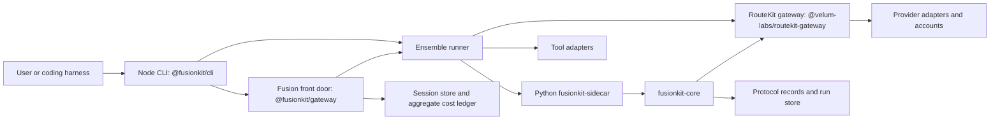
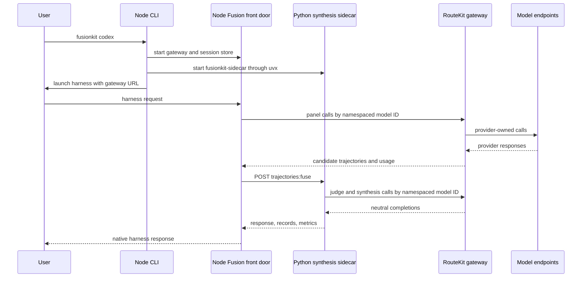

# Repository reference

This reference documents the full repository as it exists today. It is written for maintainers, package authors, release owners, and advanced users who need to understand how FusionKit is assembled across TypeScript, Python, schemas, apps, examples, and operations.

The public product is FusionKit: model fusion behind coding agents and raw inference clients. The repository also contains Warrant governance and VM-isolation packages that predate the current product focus. Those packages remain documented because they are still published, tested, and referenced by release tooling, but they are outside the shipped ensemble runtime path unless a page says otherwise.

## How to use this reference

Start with the product path if you are debugging the `fusionkit` command. Start with the package map if you are planning code changes. Start with the protocol section if you are changing schemas, generated bindings, traces, or records. Start with the examples section if you need a runnable scenario that proves a behavior.

Each package entry names responsibility, scope, entry points, relevant functions or types, tests, and a practical example. Public exports receive priority. Private helpers are documented when they carry important behavior, safety properties, or cross-package contracts. For deeper symbol-level documentation, use [TypeScript reference](typescript-reference.md), [Python reference](python-reference.md), [Source symbol index](source-symbol-index.md), [Generated code API reference](generated/code-api.md), [Specs and APIs](specs-and-apis.md), [Apps and examples](apps-and-examples.md), [Repository coverage map](repository-coverage-map.md), and [Operations and scripts](operations-and-scripts.md).



The most important operational fact is the process boundary. Node owns harness UX, tool launchers, worktrees, sessions, the public gateway, provider accounts, routing, pricing, retries, and user configuration. Python is an internal synthesis sidecar: it receives trajectories, calls namespaced RouteKit model IDs for judge/synthesis, and owns fusion prompts and native run records.

## Top-level repository layout

The root `package.json` is a private pnpm workspace named `fusionkit-monorepo`. Its `engines` field declares Node `>=22.0.0` and pnpm `>=10.33.4`, but the effective Node floor is `>=22.19.0`: `.npmrc` sets `engine-strict=true` and the pinned `undici` dependency requires Node `>=22.19.0`, so installs fail on older 22.x runtimes. Turborepo orchestrates per-project builds and tests across `packages/*`, `examples/*`, and `apps/*`; `pnpm check` remains the repository invariant gate and `pnpm verify` runs check, build, and test in order.

The root `pyproject.toml` is a virtual uv workspace. It is not a Python package by itself. It binds every package under `python/` into one lockfile and configures shared Ruff, Pyright, pytest, and coverage settings. `uv sync --all-packages` prepares the Python workspace, and `uv run pytest` runs the Python test suite.

The `packages/` directory contains the TypeScript workspace: the CLI, terminal UI (`cli-ui`), ensemble runtime, model gateway, protocol, registry, tracing, harness-core, runtime-utils, workspace helpers, tool integrations, local model adapter, kernel, and the private `testkit` and `example-utils` support packages. The legacy platform packages — plane, runner, SDK, handoff SDK, compute adapter, and session backends — live under `legacy/packages/`, outside the root pnpm workspace.

The `python/` directory contains the provider-neutral fusion engine and sidecar, optional MLX and evaluation tools, the RouteKit simulator testkit, the Hyperkit experiment platform, and UniRoute experiments. The PyPI package named `fusionkit` exposes only `fusionkit-sidecar`; the Node CLI invokes it through `uvx`.

The `apps/` directory contains two private members of the root Node workspace.
`apps/docs` is the Fumadocs documentation site. `apps/scope` is the local
observability UI for fusion traces and run inspection. Both share the root
pnpm lockfile and are built through Turbo.

The `spec/` directory contains JSON Schemas, OpenAPI contracts, generated TypeScript and Python bindings, fixtures, fusion trace contracts, and dated design specifications. Schema changes should be treated as protocol changes and coordinated with generated code.

The `examples/` directory contains the product examples only: `examples/runtime-kernel` (the manifest-driven demo) and the `examples/mlx` infra tools. The legacy Warrant examples, including the `bench` performance-budget demo, live under `legacy/examples/` and are not listed in `examples/manifest.json`.

The `docs/` directory is the maintainer documentation layer. The public site under `apps/docs/content/docs/` is the canonical user-facing layer when the two overlap.

Several other top-level directories support the experiment platform: `lab/` is the shared Hyperkit experiment lab (see `lab/AGENTS.md`), `infra/` holds Hyperkit Terraform, hypergrid Batch, and observability deploy assets, `docker/` holds the Hyperkit runner and controller images, `analysis/` and `labruns/` hold experiment analysis working sets and lab run artifacts, and `configs/` holds example fusion and benchmark-panel YAML configs.

## Product architecture

FusionKit supports two primary usage modes. In coding-harness mode, commands such as `fusionkit codex`, `fusionkit claude`, and `fusionkit cursor` launch an existing agent CLI and place a model ensemble behind it. In raw endpoint mode, `fusionkit serve` exposes an OpenAI-compatible endpoint that clients can call directly.

The ensemble path begins in `@fusionkit/cli`. The CLI reads
`.fusionkit/fusion.json`, delegates provider and local model configuration to
RouteKit, runs preflight checks, starts the internal Python sidecar when
needed, and launches the selected harness integration. Its public server is
RouteKit's `startGateway()` configured with FusionKit's `FusionBackend`:
RouteKit translates wire dialects and performs provider egress, while the
Fusion backend records aggregate cost and session state, runs the panel, and
sends completed trajectories to Python for synthesis.

The Python side receives trajectories and synthesizes results. `fusionkit_core.fusion.FusionEngine` coordinates fusion-mode policy and judge synthesis. Its only production model client speaks RouteKit's neutral OpenAI-compatible gateway using namespaced model IDs. `fusionkit_core.run.FusionRunManager` creates durable native run records, tool policy pauses, idempotency records, and protocol artifacts.



## TypeScript packages

### `@fusionkit/cli`

`@fusionkit/cli` is the primary product surface and publishes the `fusionkit` binary. Its entry script is `packages/cli/src/index.ts`, which builds the Commander program and handles top-level process errors. The command tree is built by `buildProgram()` in `packages/cli/src/cli.ts`.

The package owns Fusion-only launcher commands for `codex`, `claude`, `cursor`, `opencode`, and `serve`; local-model lifecycle; sessions; config; setup; doctor; and named namespaced-model ensembles. RouteKit owns provider routing, accounts, proxies, and direct/single-model launches.

Important behavior includes preflight validation through `PreflightError`, version reporting that names both the npm CLI and pinned PyPI synthesizer, bare invocation help, and fail-closed policy error reporting for governed execution paths.

Example:

```bash
pnpm --filter @fusionkit/cli build
node packages/cli/dist/index.js doctor
node packages/cli/dist/index.js config show
node packages/cli/dist/index.js codex --budget 1.25
```

### `@fusionkit/ensemble`

`@fusionkit/ensemble` is the TypeScript ensemble runtime and the largest public surface in the workspace. It owns command harnesses, candidate worktrees, judge synthesis adapters, runtime-kernel workflow composition, advanced operators, schedulers, tool execution, isolation helpers, and legacy model-fusion workflow bridges.

The product-facing functions are `runEnsemble`, `ensemble`, `buildPanelPrompt`, `runFusionPanels`, `runFusionPanelWorkflow`, `runUnifiedHarnessE2E`, `setToolHarnessProvider`, and `createFusionKitJudgeSynthesizer`. These coordinate panel execution, harness selection, per-model worktrees, trajectory capture, and fused output.

The runtime-kernel exports include `GraphBuilder`, `graph`, `refs`, `registerWorkflow`, `listWorkflows`, `getWorkflow`, `runWorkflow`, `FusionRuntime`, `StaticDAGScheduler`, `DirectFastPathScheduler`, `InMemoryKernelStateStore`, and `createRuntimeReplayRecord`. These are used when fusion behavior is represented as typed operator graphs instead of a single imperative flow.

The operator exports include `ModelGenerateOperator`, `PanelGenerateOperator`, `JudgeCompareOperator`, `SynthesizeOperator`, `RouteOperator`, `SelectOperator`, `RepairOperator`, `ReviewOperator`, `PairRankOperator`, `TreeExpandOperator`, `TreeScoreOperator`, `EvidenceSourceOperator`, `DelegateOperator`, `GenFuserOperator`, and `SchemaValidationOperator`. Scheduler exports include `BestOfNScheduler`, `FixedLayerMoAScheduler`, `RankFuseScheduler`, `ExecutionSelectRepairScheduler`, `TreeSearchScheduler`, `AdaptiveRouterScheduler`, `AgenticDelegationScheduler`, `OfflineArchitectureSearchScheduler`, and `LearnedWorkflowScheduler`.

Worktree and isolation exports include `createWorktreePlan`, `cleanupWorktreePlan`, `cleanupCandidateWorktree`, `diffCandidateWorktree`, `sealCandidateWorktree`, `defaultOutputRoot`, `createCliContainerDriver`, `runCandidateCommandWithIsolation`, `secretAbsenceMetadata`, and `secretValueHash`.

Example:

```ts
import { graph, refs, registerBuiltInWorkflows, runWorkflow } from "@fusionkit/ensemble";

registerBuiltInWorkflows();

const workflow = graph("example-direct-model")
  .task("prompt", { kind: "task.input", input: refs.input("request") })
  .build();

await runWorkflow(workflow, {
  input: { request: "Summarize the repository architecture." }
});
```

### `@velum-labs/routekit-gateway`, `@velum-labs/routekit-accounts`, and `@fusionkit/gateway`

`@velum-labs/routekit-gateway` is the canonical neutral router and HTTP boundary. It owns
wire dialects, SSE, ACP, provider egress, live namespaced catalogs, reusable
capacity pooling, and normalized single-call cost/provenance.

`@velum-labs/routekit-accounts` owns subscription credential sources, quota/health
tracking, account pools, relays, and the proxy/client wire contract.

`@fusionkit/gateway` depends on those neutral packages and owns only the Fusion
frontdoor, panel/synthesis flow, sessions, aggregate budgets, trajectory
conversion, and managed local-model lifecycle.

### `@fusionkit/protocol`

`@fusionkit/protocol` is the zero-runtime-dependency contract layer. It defines FusionKit model-fusion contracts, receipts, event chains, manifests, policies, checkpoints, handoff envelopes, model-fusion schemas, generated OpenAPI clients, hashing, signing, verification, generated trace conventions, and validation helpers.

Validation and normalization exports include `parseHostAllowlistEntry`, `parsePoolName`, `parseSecretName`, `parseWorkspaceManifestPath`, `assertWireTrajectory`, `isWireTrajectory`, `normalizeWireTrajectories`, and the generated model-fusion assertion functions such as `assertHarnessRunRequestV1`, `assertHarnessRunResultV1`, `assertModelFusionRecord`, `assertEnsembleReceiptV1`, and `assertToolExecutionRecordV1`.

Cryptographic and provenance exports include `canonicalize`, `sha256Hex`, `sha256PrefixedHex`, `hashCanonical`, `hashCanonicalSha256`, `requestHash`, `responseHash`, `artifactHash`, `schemaBundleHash`, `generateEd25519KeyPair`, `keyIdFromPublicPem`, `signData`, `verifyData`, `contractHash`, `signContract`, `appendEvent`, `verifyChain`, `signReceipt`, `verifyRunnerReceipt`, and `verifyReceiptBundle`.

Trace exports are the generated fusion semantic-convention constants (`ATTR`, span/event name lists, `EXPORTABLE_ATTRIBUTES`); the OpenTelemetry-backed span and event helpers live in `@fusionkit/tracing`.

Example:

```ts
import {
  assertWireTrajectory,
  normalizeWireTrajectories,
  schemaBundleHash
} from "@fusionkit/protocol";

const trajectories = normalizeWireTrajectories([candidateTrajectory]);
for (const trajectory of trajectories) {
  assertWireTrajectory(trajectory);
}

console.log(schemaBundleHash());
```

### `@fusionkit/workspace`

`@fusionkit/workspace` captures and materializes git workspaces. It is used by the CLI, runner, handoff SDK, and ensemble worktree flows when code must be copied safely, compared, or pulled back.

The public functions include `captureWorkspace`, `materializeWorkspace`, `collectOutputs`, `pullSessionOutputs`, `gitText`, `parseWorkspaceRelativePath`, and `resolveInsideWorkspace`. The exported types describe capture options, materialized sessions, output collection, and path validation.

The important invariant is that paths are resolved inside the workspace boundary and secret-pattern denial is applied during capture or materialization flows. This package should be touched whenever behavior changes how repository contents move between local workspaces, sessions, and outputs.

Example:

```ts
import { captureWorkspace, materializeWorkspace } from "@fusionkit/workspace";

const manifest = await captureWorkspace({ root: process.cwd() });
await materializeWorkspace({
  root: "/tmp/fusionkit-session",
  manifest
});
```

### `@velum-labs/routekit-tools`

`@velum-labs/routekit-tools` defines product-neutral launcher, canonical-driver, and capability metadata. A host registers `ToolIntegration` values and supplies opaque model entries plus generic agent profiles through one `ToolLaunchSpec`.

Important exports include `ToolIntegration`, `ToolLaunchSpec`, `ToolLaunchContext`, `AgentProfile`, `createToolRegistry`, and `createToolCapabilityMatrix`.

### `@velum-labs/routekit-tool-registry`

`@velum-labs/routekit-tool-registry` imports every shipped `@velum-labs/routekit-tool-*` integration,
owns the single canonical `toolIntegrations` list, and exports the constructed
`toolRegistry`. RouteKit and FusionKit consume the same instance; FusionKit's
only product composition is passing it to `setToolDriverRegistry`.

Example:

```ts
import { toolRegistry } from "@velum-labs/routekit-tool-registry";

console.log(toolRegistry.list().map((tool) => tool.id));
```

### Tool integration packages

`@velum-labs/routekit-tool-codex`, `@velum-labs/routekit-tool-claude`, `@velum-labs/routekit-tool-cursor`, and `@velum-labs/routekit-tool-opencode` each own one launcher/serializer and one canonical `HarnessDriver`.

`@velum-labs/routekit-tool-codex` owns Codex catalog/profile serialization, launch, and its SDK driver.

`@velum-labs/routekit-tool-claude` owns Claude agent-profile serialization, launch, and its Agent SDK driver.

`@velum-labs/routekit-tool-cursor` owns Cursor CLI/IDE launch, bridge configuration, and its ACP driver.

`@velum-labs/routekit-tool-opencode` owns OpenCode configuration, launch, and its SDK driver.

Example:

```ts
import { claudeTool } from "@velum-labs/routekit-tool-claude";
import { codexTool } from "@velum-labs/routekit-tool-codex";
import { cursorTool } from "@velum-labs/routekit-tool-cursor";

const tools = [codexTool, claudeTool, cursorTool];
for (const tool of tools) {
  console.log(`${tool.displayName}: ${tool.driver.kind}`);
}
```

### `@fusionkit/adapter-ai-sdk`

`@fusionkit/adapter-ai-sdk` is the AI SDK side of FusionKit local-model flows. It contains managed MLX local-model helpers and worktree agent utilities. The governed helpers (`remoteTools`, `swarmTools`, `handoffModel`, `routedModel`) moved to the legacy `@fusionkit/handoff` package.

Important exports include `runWorktreeAgent`, `worktreeDiff`, `defaultMlxDir`, `MlxCapabilityError`, `MlxEnv`, `managedModelServer`, and `mlxServer`.

Use this package when an application needs the managed MLX server path or worktree agent utilities.

Example:

```ts
import { mlxServer } from "@fusionkit/adapter-ai-sdk";

const server = await mlxServer({
  model: "mlx-community/Qwen3-4B-4bit",
  port: 8080
});

console.log(server.baseUrl);
await server.close();
```

### `@fusionkit/kernel`

`@fusionkit/kernel` is the dependency-free runtime kernel substrate. It re-exports runtime, graph utilities, graph validation, artifact types, and wire artifacts. It is suitable for packages that need typed artifacts, operators, graphs, schedulers, budgets, traces, outcomes, streaming, and replay primitives without depending on the larger ensemble package.

Important exports come from `runtime.ts`, `graph-utils.ts`, `graph-validation.ts`, `artifact-types.ts`, and `wire-artifacts.ts`. Use it when defining or validating operator graphs outside the full ensemble package.

Example:

```ts
import { validateOperatorGraph } from "@fusionkit/kernel";

const issues = validateOperatorGraph(myGraph);
if (issues.length > 0) {
  throw new Error(issues.map((issue) => issue.message).join("\n"));
}
```

### Product support packages

`@velum-labs/routekit-cli-ui` is the brand-configurable terminal presentation layer; `@velum-labs/routekit-cli-core` owns command context, errors, common option parsing, completion, package-version formatting, and reusable CLI test helpers. FusionKit composes both and keeps product options in `@fusionkit/cli`.

`@velum-labs/routekit-harness-core` is the product-neutral coding-agent harness contract: driver, instance, and session interfaces, canonical events, tagged errors, approval policies, status probes, and shared stream/process primitives. The `@velum-labs/routekit-tool-*` packages implement it; product orchestrators adapt those drivers.

`@fusionkit/registry` contains Fusion-only identities, aliases, and panel presets
generated from `spec/registry/fusion.json`. `@velum-labs/routekit-registry` owns the
product-neutral provider/auth metadata, model and local catalogs, capability
quirks, discovery, and pricing generated from the other `spec/registry` sources.
Python receives the matching split generated bindings.

`@velum-labs/routekit-runtime` is the canonical owner for process supervision, child environments, cleanup, atomic files and locks, ports, and product-parameterized portless service registration.

`@velum-labs/routekit-config-core` and `@velum-labs/routekit-telemetry-core` provide the layered config IO/migration and parameterized consent/redaction/event plumbing used by the FusionKit CLI.

`@velum-labs/routekit-tracing` owns the generic OpenTelemetry provider, propagation, listener, and export-redaction runtime. `@fusionkit/tracing` is a one-way conventions facade that supplies Fusion attributes, scopes, baggage, and names.

### Legacy and platform TypeScript packages

The packages in this section live under `legacy/packages/`, outside the root pnpm workspace.

`@fusionkit/plane` is the Warrant control plane. It exports `Plane`, `startPlaneServer`, `defaultPolicy`, `evaluatePolicy`, `ClaimTokenService`, `ContractService`, `ReceiptService`, `SqliteStore`, `SecretStore`, key-management helpers, authorization helpers, `IdpVerifier`, `RateLimiter`, `Metrics`, retention helpers, and domain error types. It owns policy evaluation, approval records, receipt countersignature, secret release, audit export, metrics, and durable SQLite storage.

`@fusionkit/runner` is the outbound execution worker. It exports `Runner`, `CapabilityMismatchError`, session backend types, execution kinds, and preparation helpers. It claims work from the plane, executes sessions through a configured backend, enforces egress integration, and reports receipts.

`@fusionkit/sdk` exports `PlaneClient` and `PlaneClientError`. It is the thin TypeScript client for the plane API and offline receipt verification helpers.

`@fusionkit/handoff` exports `defineHandoffConfig`, `Handoff`, `handoff`, `HandoffRun`, `checkpoint` helpers, `targets`, `agents`, `localFirst`, `triggers`, `branch`, `reviewStrategies`, and `scorecardFor`. It provides the continuation-first SDK on top of Warrant primitives.

`@fusionkit/adapter-compute` exports `governedCompute`, `GovernedSandbox`, and `withCompute`. It presents a ComputeSDK-shaped sandbox interface backed by governed runner sessions.

`@fusionkit/session-hermetic` exports `HermeticSessionBackend`, `hermeticBackend`, and `toJustBashNetwork`. It implements a virtual filesystem and just-bash interpreter backend with interpreter-enforced network policy.

`@fusionkit/session-vercel-sandbox` exports `VercelSandboxBackend`, `vercelSandboxBackend`, `shellQuote`, `listWorkspaceFiles`, `writeMirroredFile`, `vercelCredentialsFromEnv`, `toVercelNetwork`, and sandbox types. It bridges governed sessions to Vercel Sandbox microVMs.

`@fusionkit/session-harness` exports `AiSdkHarnessBackend`, `harnessBackend`, `isAgentRunFor`, Pi harness helpers, auth helpers, and `TranscriptRecorder`. It drives vendor harnesses through AI SDK harness bindings inside governed sessions.

The legacy fixture package at `legacy/packages/testkit` exports `git`, `makeRepo`, `uploadWorkspace`, `mockRunRequest`, `withStackAndRepo`, and `startStack` for in-process plane and runner tests. It is distinct from the root `packages/testkit`: that `@velum-labs/routekit-testkit` is the cross-stack E2E tooling exporting `startProviderSim`, `startEngine`, `simSidecarConfigYaml`, `scriptFusedTurn`, `parseSse`, and `detectStackTooling` (see [Testing](testing.md)).

`@fusionkit/example-utils` exports demo manifest parsing, mock model helpers, live model helpers, and narration utilities used by examples.

Example:

```ts
import { Plane } from "@fusionkit/plane";
import { Runner } from "@fusionkit/runner";
import { hermeticBackend } from "@fusionkit/session-hermetic";

const plane = new Plane({ storage: "memory" });
const runner = new Runner({
  planeUrl: "http://127.0.0.1:4310",
  backend: hermeticBackend()
});

console.log(Boolean(plane), Boolean(runner));
```

## Python packages

### `fusionkit-core`

`fusionkit-core` contains provider-neutral model-fusion primitives. It is the implementation center for sidecar configuration, the thin RouteKit client, fusion-mode selection, trajectory production, judge synthesis, run records, artifacts, metrics, tracing, and protocol conversions.

`fusionkit_core.config` defines `RunBudget`, `ContextPolicy`, `SamplingConfig`, `PromptOverrides`, `FusionConfig`, and `load_config()`. `FusionConfig` contains one RouteKit URL, namespaced model IDs, model-role selections, and fusion policy only.

`fusionkit_core.model_client` defines the neutral `ChatClient` protocol. `fusionkit_core.routekit_client` implements that protocol over RouteKit's OpenAI-compatible gateway, while `fusionkit_core.fake_client` supports deterministic tests. `build_clients()` creates one RouteKit client per namespaced model ID.

`fusionkit_core.fusion` defines `FusionEngine` and `normalize_messages()`. The engine runs panel calls, direct calls, streaming calls, tool-aware calls, and fusion requests.

`fusionkit_core.judge` defines `FuseResult`, `JudgeSynthesizer`, `accumulate_tool_call()`, and `parse_analysis()`. The synthesizer reads candidate trajectories, calls the judge model, produces rationale and final output, and emits metrics.

`fusionkit_core.run` defines `FusionRunManager`, `make_id()`, `canonical_json()`, and `hash_json()`. The run manager owns native run lifecycle, tool policy pauses, idempotency, artifact writing, event pages, inspections, budget errors, and run metrics.

`fusionkit_core.run_models` defines `NativeRunError`, `ToolExecutionPolicy`, `ToolPausePlaceholder`, `ToolResultSubmission`, `FusionRunEvent`, `IdempotencyRecord`, `CreateRunResult`, `RunStateSummary`, `TrajectoryInspection`, `RunInspection`, `RunEventPage`, `RunStore`, and `ArtifactWriter`.

`fusionkit_core.contracts` defines the Fusion-used Python model-fusion contract models, including `ContractMetadata`, `ArtifactRefV1`, `ModelCallRecordV1`, `FusionRunRequestV1`, `FusionRecordV1`, `HarnessRunRequestV1`, `HarnessRunResultV1`, `HarnessCandidateRecordV1`, `TrajectoryV1`, `ToolCallPlanV1`, `ToolExecutionRecordV1`, `EnsembleReceiptV1`, `schema_bundle_hash()`, `producer()`, `producer_version()`, `producer_git_sha()`, `contract_metadata()`, `contract_model_for_schema()`, and `status_for_run_state()`. The provider-only `model_endpoint.v1` binding is not carried in `fusionkit-core`.

`fusionkit_core.types` defines the runtime chat and fusion data models: `ToolCall`, `ChatMessage`, `Usage`, `CallMetrics`, `ModelResponse`, `StreamChunk`, `TrajectorySynthesis`, `Trajectory`, `FusionAnalysis`, and `FusionResult`.

`fusionkit_core.producers` defines trajectory production utilities: `trajectory_from_response()`, `failed_trajectory()`, `trajectory_to_contract()`, `trajectory_from_contract()`, `PanelExhaustedError`, `ToolExecutor`, `TrajectoryProducer`, `ChatTrajectoryProducer`, `ExternalTrajectoryProducer`, and `AgentTrajectoryProducer`.

`fusionkit_core.run_store` defines `FileSystemRunStore`, which persists run state, events, artifacts, tool pauses, idempotency records, and inspections to the local filesystem.

`fusionkit_core.trace` defines `setup_fusion_tracing()`, `fusion_span()`, `start_fusion_span()`, `end_fusion_span()`, `emit_event()`, `context_from_headers()`, and `candidate_baggage_of()` over the OpenTelemetry SDK.

`fusionkit_core.artifacts` defines `hash_bytes()`, `hash_text()`, and `LocalArtifactStore`.

`fusionkit_core.router` defines `RouterDecision` and `FusionModeRouter`.

Example:

```python
from fusionkit_core.config import load_config
from fusionkit_core.clients import build_clients
from fusionkit_core.fusion import FusionEngine

config = load_config(".fusionkit/fusion.yaml")
engine = FusionEngine(config, build_clients(config))
```

### `fusionkit-server`

`fusionkit-server` is the internal Python synthesis sidecar. The central
function is `fusionkit_server.app.create_app()`. It wires the neutral RouteKit
client, fusion engine, native run APIs, and tool-resume APIs.

Its routes are `/health`, `/v1/fusion/trajectories:fuse`, and the required
`/v1/fusion/runs` read/write/resume routes. The public protocol gateway lives
in Node `@velum-labs/routekit-gateway`.

Example:

```bash
uv run --package fusionkit fusionkit-sidecar serve \
  --config .fusionkit/sidecar.yaml --port 8000
curl http://127.0.0.1:8000/health
```

### Python sidecar and maintainer CLI

The PyPI package named `fusionkit` is implemented under
`python/fusionkit-cli` and exposes only
`fusionkit-sidecar = "fusionkit_cli.main:app"`. The user-facing `fusionkit`
binary belongs to the Node package.

The sidecar CLI has `serve`, `prompts dump`, and `--version`. Benchmark,
tuning, and hill-climb commands are installed separately as
`fusionkit-bench` by `fusionkit-evals`.

Example:

```bash
uv run --package fusionkit fusionkit-sidecar serve --config sidecar.yaml --port 8000
uv run --package fusionkit fusionkit-sidecar prompts dump --dir .fusionkit/prompts
uv run --package fusionkit-evals fusionkit-bench --help
```

### `fusionkit-evals`

`fusionkit-evals` contains benchmarks, prompt tuning, public benchmark reporting, hill climbing, Pareto analysis, sandboxed execution, and scoring utilities. It owns the canonical `fusionkit_evals.cli:bench_app` implementation and does not depend on the `fusionkit` sidecar package.

Important modules include `fusion_bench`, `fusion_hillclimb`, `fusion_compound`, `benchmark`, `benchmark_panel`, `dirty_dozen`, `public_bench`, `public_bench_report`, `prompt_tuning`, `pareto`, `exec_select`, `candidate_bank`, `bench_verify`, `bench_stats`, and `gateway_target`.

Key symbols include `FusionBenchRunner`, `BenchmarkRunner`, `run_climb`, `check_target`, scorer functions, code extraction helpers, and report writers. Adapters under `python/fusionkit-evals/src/fusionkit_evals/adapters/` connect the evaluation system to LiveCodeBench, Aider-style polyglot tasks, and selection experiments.

Example:

```bash
uv run --package fusionkit-evals fusionkit-bench fusion --config .fusionkit/sidecar.yaml
uv run --package fusionkit-evals fusionkit-bench fusion-report --input artifacts/fusion-bench/latest.json
uv run --package fusionkit-evals fusionkit-bench hillclimb --config .fusionkit/sidecar.yaml
```

### `fusionkit-mlx`

`fusionkit-mlx` contains optional MLX helper utilities. The important module is `fusionkit_mlx.launcher`, which supports local MLX serving and lifecycle integration used by the Node local-model path and Python experiments.

Use this package only on machines that can run MLX. The Node CLI should fail early with platform guidance when a user requests local MLX on an unsupported platform.

### `fusionkit-testkit`

`fusionkit-testkit` is the never-published test tooling package: a scriptable, observable RouteKit gateway simulator, config builders that point sidecar configs at namespaced model IDs, a real `fusionkit-sidecar serve` child-process harness, and workspace-wide pytest fixtures. The standalone simulator runs as `fusionkit-sim`. See [Testing](testing.md).

### `hyperkit`

`hyperkit` is the system-under-test-agnostic experiment platform. It ships the `hyperkit` CLI (plan, extend, apply, resume, status, collect, pull, controller, local-controller, replay-swebench), benchmark adapters (`livecodebench`, `swebench`, `terminal_bench`), and AWS Batch and local compute backends. The maintainer-only `fusionkit-evals` package registers a Node-gateway `fusionkit-serve` SUT through the `hyperkit.suts` entry point. See [Hyperkit](hyperkit.md).

### `uniroute` and `uniroute-mlx`

`uniroute` is a NumPy implementation of dynamic-pool UniRoute model routing. It exposes routers, synthetic data helpers, trial utilities, k-means helpers, learned maps, evaluation helpers, and a `uniroute-demo` script.

`uniroute-mlx` bridges UniRoute concepts to locally served models. It exposes `uniroute-mlx` as a CLI, client helpers, evaluation helpers, and router-card generation. These packages predate the current FusionKit merge and are not included in the root Pyright scope, but they are part of the uv workspace and pytest discovery.

Example:

```bash
uv run --package uniroute uniroute-demo
uv run --package uniroute-mlx uniroute-mlx --help
```

## Apps

`apps/docs` is the public documentation site. It uses Next.js 15, React 19,
Fumadocs, MDX content, a generated OpenAPI bridge, and a Mermaid component.
Content lives under `apps/docs/content/docs/`. Its scripts and Vercel
configuration use the root pnpm workspace and a filtered Turbo build.

Relevant files include `source.config.ts`, `lib/source.ts`, `lib/openapi.ts`, `scripts/generate-openapi.ts`, `components/mermaid.tsx`, and `content/docs/meta.json`. When user-facing content overlaps with maintainer docs, the site should be considered canonical.

Example:

```bash
pnpm install --frozen-lockfile
pnpm --filter fusionkit-docs dev
```

`apps/scope` is the local observability companion. It is used to inspect
fusion traces, sessions, judge flow, and run state. It is a private workspace
app whose production build is staged into the FusionKit CLI package.

Example:

```bash
pnpm exec turbo run test --filter=scope
```

## Protocols, schemas, and generated code

The model-fusion contract lives under `spec/model-fusion-contract/`. JSON Schemas define records such as trajectories, harness run requests, harness run results, fusion records, model call records, tool execution records, and ensemble receipts. The OpenAPI contract lives under `spec/model-fusion-contract/openapi/`. Fixtures live under `spec/model-fusion-contract/fixture/`.

Generated TypeScript bindings live under `spec/model-fusion-contract/gen/typescript/` and are consumed by `@fusionkit/protocol`. Generated Python bindings live under `spec/model-fusion-contract/python/` as `velum_model_fusion_protocol`.

The fusion semantic conventions live under `spec/fusion-trace/registry.json` (span names, attribute keys, sensitivity classes). Runtime tracers in TypeScript and Python emit OpenTelemetry spans that follow the registry; bindings are generated by `scripts/generate-trace-conventions.mjs`.

When changing a schema, update the schema, regenerate bindings, update fixtures, update protocol assertions, and run both TypeScript and Python tests that consume the affected contract. The repository includes `scripts/generate_protocol_codegen.py` for code generation.

Example:

```bash
uv run python scripts/generate_protocol_codegen.py
pnpm build
uv run pytest tests/test_model_fusion_contract.py
```

## Examples

`scripts/demo.mjs` and `examples/manifest.json` coordinate example execution. The manifest currently lists one demo: `examples/runtime-kernel` (id `15`), which demonstrates composing runtime-kernel workflows. The manifest's `infra` section lists `examples/mlx`, the Apple Silicon managed-MLX smoke and stress tools run through `pnpm mlx` and `pnpm mlx:stress` rather than the demo harness.

The legacy Warrant examples live under `legacy/examples/` and are not runnable through `pnpm demo`. They document retained Warrant functionality: `governed-run` (governed run with offline-verifiable receipt), `dry-run`, `offline-verify`, `consent-secrets`, `egress-policy`, `handoff`, `parallel-fanout`, `model-escalation`, `ai-sdk-loop` (app-owned AI SDK loops with governed remote tools from legacy `@fusionkit/handoff`), `swarm`, `compute-sandbox`, `hermetic-session`, `microvm-isolation-bench`, `control-panel`, `seed`, `golden-interface`, and the `bench` performance-budget benchmark (formerly `examples/bench`).

Example:

```bash
pnpm build
pnpm demo all
pnpm demo 15   # runtime-kernel
```

## Scripts and automation

`scripts/check-repo.mjs` enforces repository invariants, required files, and dependency allowlists. It is the first command in `pnpm verify`.

`scripts/demo.mjs` runs examples through a manifest-driven harness. Use it after building packages.

`scripts/release.mjs` coordinates release planning, applying, graph inspection, and state refresh. It works with files under `release/`, including desired state, current state, and workspace release metadata.

`scripts/generate_protocol_codegen.py` regenerates protocol bindings from schemas and OpenAPI contracts.

`scripts/monorepo.mjs` provides workspace helper behavior behind `pnpm mono`.

Fusion end-to-end harness scripts such as `scripts/fusion-*-e2e.mjs` are used to validate specific coding-harness flows.

Example:

```bash
pnpm check
pnpm build
pnpm test
pnpm release:plan
pnpm release:graph
```

## Configuration and runtime files

`.fusionkit/fusion.json` is the committed example of the repository-level FusionKit config. Prompt overrides live under `.fusionkit/prompts/`, especially `judge.md` and `synthesizer.md`. The Node CLI treats this tree as the source of truth and derives the Python server YAML from it.

Runtime sessions are stored outside the repository under `~/.fusionkit/sessions/`. Gateway sessions include metadata, turn records, cost accounting, and resume identifiers.

Release state lives under `release/`. Changes to this directory should be reviewed as release workflow changes, not product behavior changes.

CI lives under `.github/workflows/`. `ci.yml` runs five jobs: `check`
(repository checks, build, clean-install/OOTB smokes, tests, and demos), `scope`
(the observability app), `stack-e2e` (Node RouteKit/Fusion gateways + internal
Python sidecar + simulator suites), `python` (the uv workspace), and
`observability` (Hyperkit Grafana dashboard validation). The release workflows
are `release-packages.yml` (RouteKit and FusionKit npm packages),
`pypi-release.yml`, and `model-fusion-protocol-release.yml`.

## Testing and verification

The standard full verification command is:

```bash
pnpm verify
```

This runs repository checks, TypeScript build, and Node tests. The Python side is validated with:

```bash
uv run pytest
uv run pyright
uv run ruff check .
```

The docs and Scope apps are workspace projects and should be validated with
Turbo filters when changed:

```bash
pnpm exec turbo run build --filter=fusionkit-docs
pnpm exec turbo run test --filter=scope
```

For documentation-only changes, `pnpm check` is the most relevant root command because it catches repository invariant drift. Building the docs app is relevant when content under `apps/docs/` changes. Full `pnpm verify` is useful when examples or package references changed in a way that could indicate code drift.

## High-value maintenance examples

To add a new coding tool, create `packages/tool-<name>/`, implement a `ToolIntegration`, optionally provide a harness adapter, export it from the package entry point, register it in the CLI registry, add focused tests, and document the tool in the package map and CLI reference.

To add a model-fusion contract field, update the JSON Schema, add or update fixtures, regenerate TypeScript and Python bindings, update protocol assertion exports, update server and client code, and run schema, TypeScript, and Python tests.

To add a provider, implement its backend and wire normalization in
`@velum-labs/routekit-gateway`, add RouteKit config/catalog support, and test success,
streaming, usage, and failure behavior there. The Python sidecar remains
provider-neutral and continues to call namespaced model IDs through
`RouteKitClient`; it must not gain provider credentials or provider-specific
clients.

To add a runtime-kernel workflow, define artifact types and operator specs, validate the graph with graph-validation helpers, register the workflow, add a runnable example or test fixture, and document where the workflow sits in the fusion path.

To update user-facing docs, change `apps/docs/content/docs/` first when the material overlaps with the public site. Then update maintainer docs in `docs/` when contributors need deeper implementation detail.
