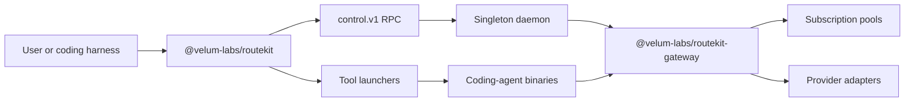
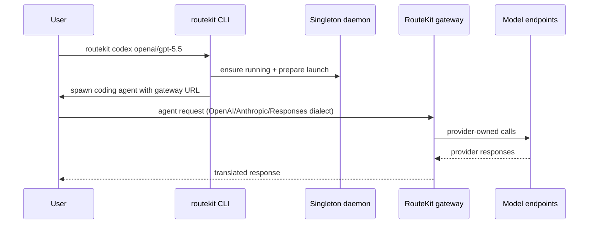

# Repository reference

This reference documents the RouteKit monorepo as it exists today. It is written for maintainers, package authors, release owners, and advanced users who need to understand how the CLI, singleton daemon, and gateway packages fit together.

The public product is RouteKit: configure providers and subscription accounts once, run a stable OpenAI-compatible gateway, and launch supported coding agents against it.

## How to use this reference

Start with the product path if you are debugging the `routekit` command. Start with the package map if you are planning code changes. Start with the configuration section if you are changing router YAML or account enrollment. For deeper symbol-level documentation, use [TypeScript reference](typescript-reference.md), [Operations and scripts](operations-and-scripts.md), the public docs site under `apps/docs` (`pnpm docs:dev`), and on-demand API docs under gitignored `apps/docs/generated/api/` after `pnpm docs:generate-code`.



The most important operational fact is the process boundary. The CLI negotiates with one daemon per `ROUTEKIT_HOME`. The daemon owns provider discovery, subscription pools, the authenticated gateway, usage, call attribution, and canonical configuration. Coding-tool processes stay local; model traffic goes through the daemon gateway.

## Top-level repository layout

The root `package.json` is a private pnpm workspace named `routekit-monorepo`. Its `engines` field declares Node `>=22.22.0` and pnpm `>=11.15.1`. `.npmrc` sets `engine-strict=true`, so installs use that declared floor together with dependency engine requirements instead of allowing older 22.x runtimes. Turborepo orchestrates per-project builds and tests across `packages/*`; `pnpm check` remains the repository invariant gate and `pnpm verify` runs check, build, package lint/types, and test in order.

The `packages/` directory contains the TypeScript workspace: the CLI, daemon, control plane, gateway, accounts, router, config, registry, tracing, harness-core, runtime utilities, tool integrations, contracts, and the private `testkit` support package.

The `spec/` directory contains JSON Schemas and generated registry bindings (`spec/registry/*.json`). Schema and registry changes should be treated as contract changes and coordinated with generated code.

The `docs/` directory is the maintainer documentation layer.

The `scripts/` directory contains repository checks, release helpers, the E2E matrix runner, and evidence generators.

## Product architecture

RouteKit supports two primary usage modes. In coding-harness mode, `routekit
codex` and `routekit claude` ask the daemon to prepare a launch, then spawn the
supported coding-agent binary against the stable gateway URL. The exact
qualified builds are recorded in
[RouteKit client compatibility](routekit-supported-clients.md). In raw endpoint
mode, external clients call the same gateway with a bearer token from
`routekit daemon auth show` or a named token from `routekit token issue`.

The path begins in `@velum-labs/routekit`. The CLI reads `~/.config/routekit/router.yaml` (or an explicit recovery path), ensures the singleton daemon is running, and issues control RPCs for configuration, accounts, and launches. `@velum-labs/routekit-gateway` translates wire dialects, discovers models from enabled providers, routes by namespaced `provider/model` IDs, and records per-call provenance.



## TypeScript packages

See [Package guide](packages.md) for the full table and [TypeScript reference](typescript-reference.md) for exports and examples. The highest-traffic packages:

### `@velum-labs/routekit`

Primary product surface and `routekit` binary. Entry script: `packages/cli/src/index.ts`. Owns lifecycle, configuration, accounts, providers, models, coding-tool launchers, remote gateways, doctor, telemetry, and completion.

### `@velum-labs/routekit-gateway`

Canonical neutral router and HTTP boundary. Owns wire dialects, SSE, ACP, provider egress, live namespaced catalogs, capacity pooling, and normalized single-call cost/provenance.

### `@velum-labs/routekit-accounts`

Subscription credential sources, quota/health tracking, account pools, relays, and the proxy/client wire contract.

### `@velum-labs/routekit-daemon` and `@velum-labs/routekit-control`

Daemon process and authenticated control RPC. The CLI never mutates RouteKit state except through control calls.

### Tool integration packages

`@velum-labs/routekit-tool-codex`, `@velum-labs/routekit-tool-claude`,
`@velum-labs/routekit-tool-cursor`, and
`@velum-labs/routekit-tool-opencode` each own one launcher/serializer and one
canonical `HarnessDriver`. `@velum-labs/routekit-tool-registry` composes them
into the single shipped registry. Cursor and OpenCode are retained internal
integrations, not current public launch surfaces.

## Scripts and automation

`scripts/check-repo.mjs` enforces repository invariants, required files, pnpm
catalog usage, Biome lint, syncpack, and dependency-cruiser boundaries.
It is the first command in `pnpm verify`. API TypeDoc output is generated on
demand for the docs site and is not checked here.

Release history for the CLI lives in [packages/cli/CHANGELOG.md](../packages/cli/CHANGELOG.md).
Changesets maintains per-package changelogs under `packages/*/CHANGELOG.md`.

Releases use `@changesets/cli` and `changesets/action`. Add intent with `pnpm changeset`; after it reaches `main`, the action maintains the Version Packages PR. Merging that PR runs `pnpm release`, publishes through npm OIDC, and creates package tags and GitHub releases. When the RouteKit package tag points at the publish commit, the workflow also creates or repairs a completed `RouteKit <version>` release in the continuous `RouteKit npm` Linear pipeline. It scans from the immediately preceding RouteKit tag, links the GitHub release and npm version, and leaves issue statuses unchanged. The pipeline access key is supplied by the `LINEAR_RELEASE_ACCESS_KEY` repository Actions secret.

`pnpm test:e2e:matrix` runs the credential-free RouteKit verification matrix (see [RouteKit end-to-end verification matrix](routekit-e2e-matrix.md)).

Example:

```bash
pnpm check
pnpm build
pnpm test
pnpm changeset
pnpm changeset status
```

## Configuration and runtime files

`~/.config/routekit/router.yaml` is the canonical router config for the singleton daemon. Project `.routekit/router.yaml` files are SDK/embedded-router inputs; import explicitly with `routekit config import --from .routekit/router.yaml`.

Runtime state lives under `ROUTEKIT_HOME` (default `~/.routekit`): daemon records, gateway bearer token, subscription credentials, usage, and telemetry consent.

Release intent and policy live under `.changeset/`. Package changelogs (for example `packages/cli/CHANGELOG.md`) are updated in the Version Packages PR.

CI lives under `.github/workflows/`. `ci.yml` runs repository checks, build, clean-install/OOTB smokes, and tests. `release-packages.yml` uses `changesets/action` for the Version Packages PR and npm publishing, synchronizes tagged publishes to Linear, and automatically promotes docs for verified releases. `publish-docs.yml` provides a main-only, `docs-production`-approved manual docs publish without an npm release. Both production docs paths use `.github/actions/deploy-docs/action.yml` and one shared concurrency group. The release tag-to-commit check skips ordinary pushes and makes release synchronization idempotently repairable by rerunning the tagged commit.

## Testing and verification

The standard full verification command is:

```bash
pnpm verify
```

This runs repository checks, TypeScript build, and Node tests.

For documentation-only changes, `pnpm check` is the most relevant root command because it catches repository invariant drift. Full `pnpm verify` is useful when package references or cross-package behavior changed.

The E2E matrix (`pnpm test:e2e:matrix`) exercises provider wires, subscription pooling, gateway dialects, and real coding-agent CLIs. See [Testing](testing.md) and [RouteKit end-to-end verification matrix](routekit-e2e-matrix.md).

## High-value maintenance examples

To add a new coding tool, create `packages/tool-<name>/`, implement a `ToolIntegration`, export it from the package entry point, register it in `packages/tool-registry`, add focused tests, and document the tool in the package map and CLI reference.

To add a provider, implement its backend and wire normalization in `@velum-labs/routekit-gateway`, add RouteKit config/catalog support in `@velum-labs/routekit-registry`, and test success, streaming, usage, and failure behavior.

To change public CLI behavior, update `packages/cli`, `docs/cli.md`, and any docs-contract tests under `packages/cli/src/test/docs-contract.test.ts`.
