# RouteKit system memory map

Current working tree: 2026-08-16.

Scope:

- all 33 pnpm workspaces: 29 packages, 3 apps and `tooling/tsgo`;
- local CLI, daemon host/workers, control plane, data plane, routers, providers, accounts, tools and telemetry;
- eval authoring, execution, promotion and online policy consumption;
- AWS/workload identity, remote SSH, docs, build, release and test surfaces;
- Effect, Promise, callback, process, stream, error and resource boundaries.

Validation:

- `pnpm depcruise`: 714 modules, 3,775 dependencies, zero violations;
- that command cruises `packages` only;
- `apps`, `scripts` and `deploy` are outside its invocation;
- `packages/eval-engine/src/vendor` and standalone eval-engine tests are explicitly excluded even though `dist/vendor` ships.

## 1. Whole-system topology

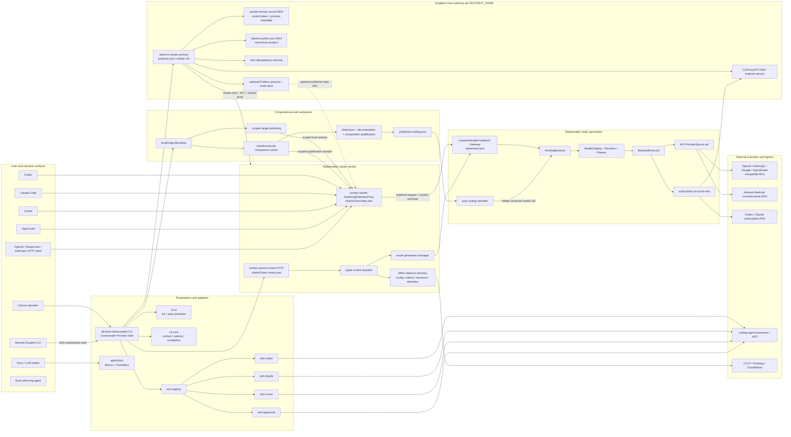

## 2. Runtime process and listener ownership

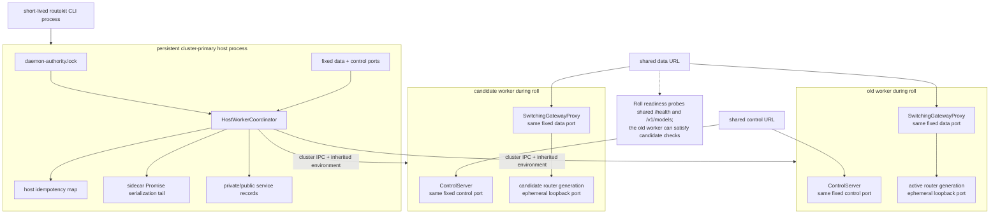

Ownership:

- host: singleton authority, worker generation, shared ports, cluster lifecycle, service records, CLIProxy lifecycle and in-memory idempotency;
- worker: control server, switching proxy, active router, tokens cache, config/account state, activity/auth coordinators, call attribution, leaderboard and telemetry;
- router generation: account pools, provider sources, model catalog, gateway and per-generation rate-limit/cooldown trackers;
- account activity/auth coordinators are shared across router generations inside one worker;
- workers overlap during a binary roll and reconstruct worker-owned state from disk.

Evidence:

- `packages/daemon/src/host.ts`
- `packages/daemon/src/host-worker-session.ts`
- `packages/daemon/src/worker.ts`
- `packages/daemon/src/daemon-bootstrap.ts`
- `packages/daemon/src/daemon-generations.ts`
- `packages/gateway/src/switching-proxy.ts`

## 3. Data-plane request sequence

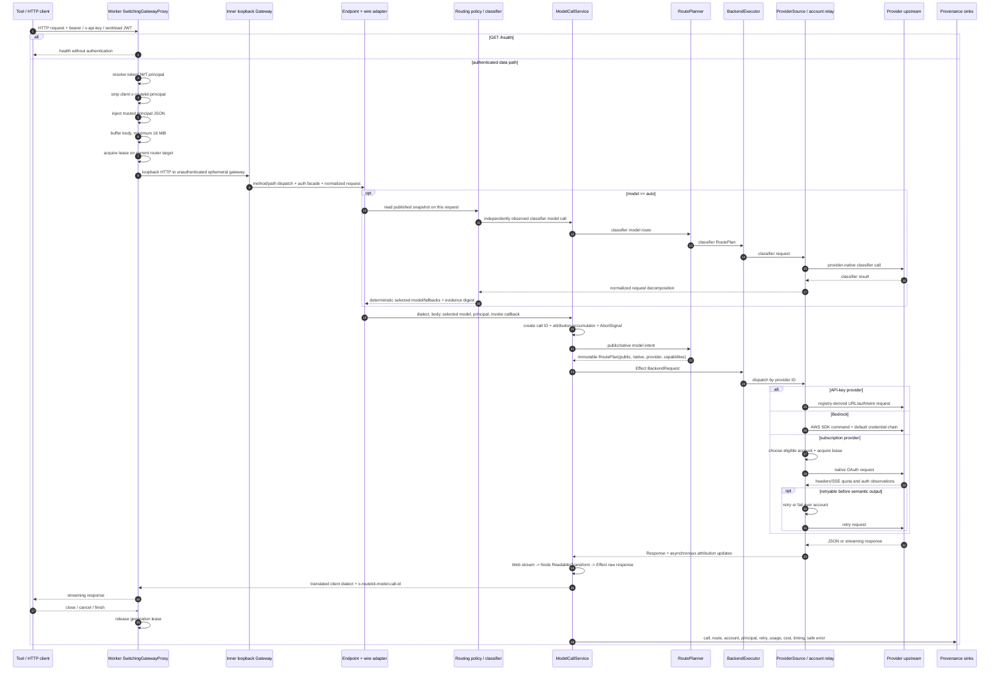

Critical trust details:

- only the outer switching proxy terminates data authentication;
- the inner ephemeral gateway is intentionally unauthenticated;
- direct access to the inner loopback port bypasses data authentication and principal attribution;
- subscription relays strip authorization but currently allow trusted `x-routekit-principal` metadata into forwarded header sets;
- opaque account seats are HMAC-derived with a process-random key and change after worker replacement;
- `model: "auto"` costs an additional classifier call before the selected model call.

Boundary/error semantics:

- proxy and inner gateway independently cap bodies at 16 MiB;
- proxy overflow throws before the inner decoder and becomes a generic 502 rather than the intended 413;
- public `/health` is unauthenticated and reports listener/draining state only—not providers, credentials, models or account pools;
- there is no CORS/OPTIONS surface;
- provider non-2xx `Response` values often pass through, while thrown failures use `gatewayErrorPayload`;
- mid-stream errors must become dialect-specific SSE failure or socket termination because status is already committed;
- subscription streaming can retry only before semantic output, buffering up to 1 MiB of SSE prelude;
- provenance observes at most roughly 2 MiB; late usage in long streams can become unknown without an explicit truncation marker;
- `x-routekit-model-call-id` forwarding to upstreams is not consistent across provider backends;
- the declared gateway tracing dependency and `EndpointPipeline` abstraction are not wired into production execution.

Primary files:

- `packages/gateway/src/switching-proxy.ts`
- `packages/gateway/src/gateway-http-app.ts`
- `packages/gateway/src/server.ts`
- `packages/gateway/src/endpoints/*`
- `packages/gateway/src/model-call-service.ts`
- `packages/gateway/src/routing-core.ts`
- `packages/gateway/src/provider-source.ts`
- `packages/gateway/src/bedrock-source.ts`
- `packages/accounts/src/subscription-request-executor.ts`
- `packages/accounts/src/subscription-stream.ts`
- `packages/accounts/src/relay.ts`
- `packages/accounts/src/codex-relay.ts`

## 4. Provider and account architecture

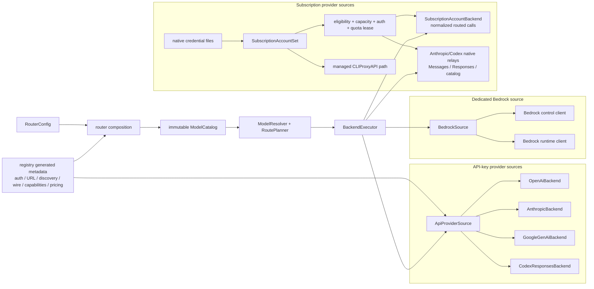

Where the abstraction holds:

- `ModelCatalog`, `ModelResolver`, `RoutePlanner` and `RoutePlan` separate pure route choice from I/O;
- `BackendExecutor` is the sole routing-core port that performs provider request I/O;
- `ProviderSource` makes discovery, request execution, Responses capability, model capability and lifecycle explicit;
- account leases hold capacity through response completion/cancellation and report quota/auth observations.

Where it breaks:

- the compatibility `Backend` still combines model operations, request execution, Responses support and lifecycle;
- Bedrock bypasses generic HTTP provider factories;
- subscriptions expose both normalized backends and provider-native relays over the same account pool;
- CLIProxy is a separately managed process/service path;
- OpenAI Responses, reasoning, server tools and provider wire details retain special cases.

Provider/support-set drift:

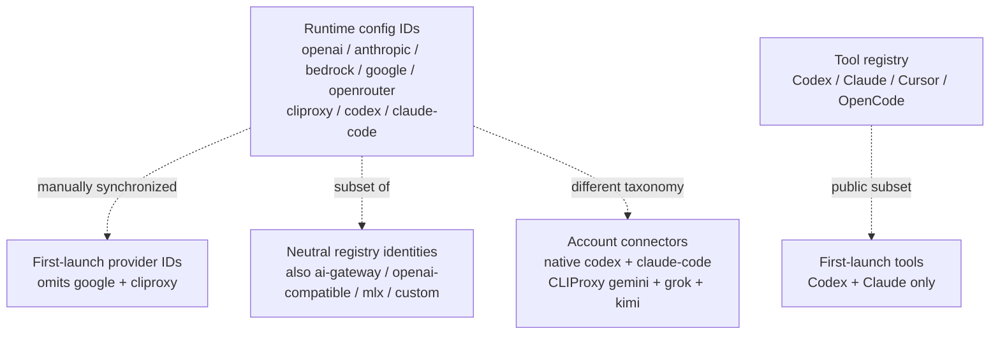

Provider behavior:

- OpenAI: bearer discovery, Chat/Responses/embeddings; no cross-provider retry;
- Anthropic: `ANTHROPIC_API_KEY` is required in runtime despite broader setup/registry wording; Messages is translated through Chat for generic routing;
- Bedrock: AWS default credential chain, model/profile discovery, Converse/ConverseStream; Responses and embeddings return 501;
- Google: `GEMINI_API_KEY`, generateContent/streamGenerateContent; valid runtime provider but absent from first-launch IDs;
- OpenRouter: OpenAI Chat protocol plus attribution headers and richer reasoning metadata; native Responses is intentionally suppressed;
- CLIProxy: managed local OpenAI-compatible service for retained Gemini/Grok/Kimi connectors; absent from first-launch IDs;
- Codex subscription: model cache fallback, native Responses relay, quota/reset-credit interpretation;
- Claude subscription: native Messages relay, OAuth recovery, Claude Code identity-prompt injection.

Routing semantics:

- startup is fail-fast: any configured provider auth/discovery failure aborts the complete router generation;
- explicit model calls never fall back across providers;
- auto-routing fallback is pre-execution availability fallback only;
- only subscription accounts have same-provider retry/member failover;
- pool strategy/threshold/probe/cooldown fields are accepted for every provider but consumed only for `codex` and `claude-code`;
- `ApiProviderSourceOptions.transport` injects discovery only, not ordinary request egress;
- provider/source/backend contracts are structurally duplicated across gateway and accounts;
- Responses capability is reconstructed by special relay branches for sources whose structural port says unsupported.

## 5. Control-plane sequence

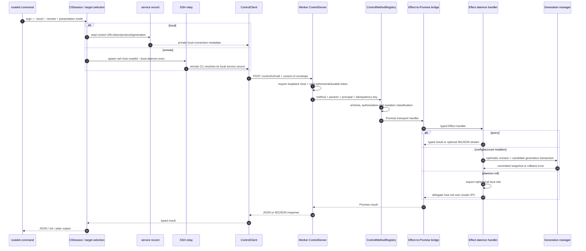

Control contract:

- `POST /control/v2/call`;
- `GET /control/v2/health`;
- protocol capability `routekit.control.v2`;
- 1 MiB body limit;
- typed `RouteKitControlParams` and `RouteKitControlResults`;
- 33 methods;
- only `daemon.roll` specifically requires the ephemeral host role;
- remote control is SSH stdin/stdout to a remote local CLI, then loopback HTTP—not direct remote control HTTP.

Method groups:

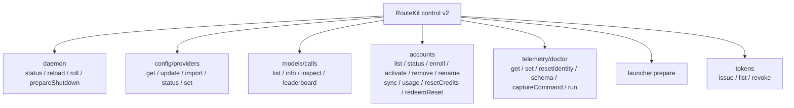

CLI surface:

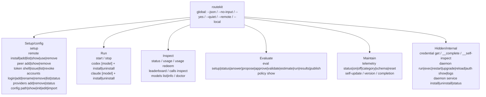

Targeting caveats:

- `start`, `stop`, `setup`, `config init` and all `daemon ...` commands are local-only;
- other commands resolve explicit remote, active remote, same-host peer or local daemon;
- `CliSession` stores target selection and the lazy managed runtime in AsyncLocalStorage ambient state;
- `models list` uses the public data catalog for remote targets rather than product control RPC.

Primary files:

- `packages/control/src/protocol.ts`
- `packages/control/src/method-registry.ts`
- `packages/control/src/method-table.ts`
- `packages/control/src/effect/handlers.ts`
- `packages/runtime/src/service/control-protocol.ts`
- `packages/runtime/src/service/control-client.ts`
- `packages/runtime/src/service/control-server.ts`
- `packages/cli/src/ssh-control.ts`
- `packages/cli/src/control-relay.ts`

## 6. Router-generation transaction

```mermaid
stateDiagram-v2
  [*] --> Stable
  Stable --> SidecarReconcile: config/account mutation
  SidecarReconcile --> CandidateStart: reconcile managed CLIProxy
  CandidateStart --> CandidateReady: load accounts + live provider discovery + start inner gateway
  CandidateStart --> Rollback: startup failure
  CandidateReady --> Persist: validate stage is callback only
  Persist --> Views: write config / revisions / domain files
  Persist --> Rollback: persistence failure
  Views --> Publish: update worker-local state/auth views
  Publish --> Active: synchronous swapTarget
  Active --> RetireOld: wait old leases
  RetireOld --> DrainOld: drain old gateway
  DrainOld --> CloseOld: close old router resources
  CloseOld --> Stable
  RetireOld --> Stable: retirement failure is logged; publication remains
  Rollback --> Stable: close candidate / restore staged state
```

Important semantics:

- candidate construction performs account loading and live provider discovery;
- configuration reload is therefore an external-network transaction;
- there is no separate health probe in the router-generation `validate` stage;
- request admission pins the selected generation until response close;
- old-generation retirement failures do not undo publication;
- account activation/removal/rename nests a crash-recovery journal around credentials, config, revisions and coordinator state;
- the durable account-transaction `committed` marker is written before final proxy publication.

## 7. Host-level worker roll

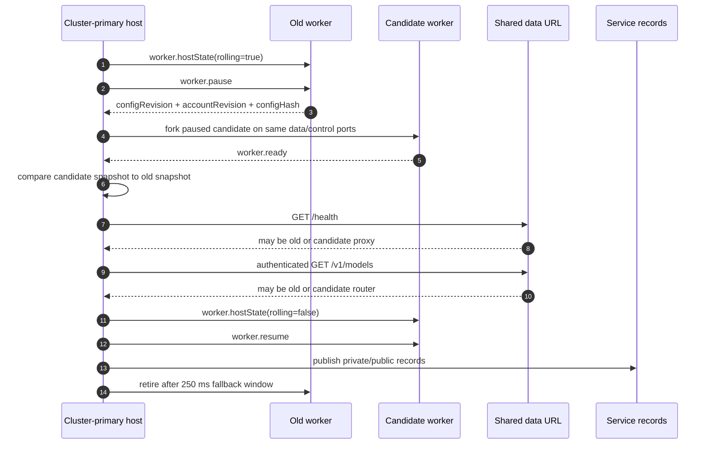

Host-roll fractures:

- readiness checks are not candidate-specific;
- overlapping control listeners mean queries can reach either worker during the roll;
- `HostWorkerCoordinator.spawn` readiness is not cancel-aware;
- readiness timeout removes a waiter but does not necessarily terminate the worker/channel;
- rollback cannot close a candidate that has forked but has not been returned;
- host and worker both write `daemon-revisions.json`;
- the host can rewrite stale config/account revisions when changing only daemon generation.

## 8. Active eval workflow

```mermaid
sequenceDiagram
  autonumber
  participant U as user/review
  participant CLI as routekit eval CLI
  participant WF as EvalProjectWorkflow
  participant FS as .routekit/evals
  participant CT as configured RouteKit target
  participant ES as scoped eval session
  participant A as author model
  participant CR as comparison runner
  participant CL as classifier model
  participant ER as evalRouting control API
  participant AS as routing activation store

  U->>CLI: eval setup / answer
  CLI->>WF: persist typed configuration
  WF->>FS: atomic project.json

  U->>CLI: eval propose dimensions
  CLI->>CT: evalSession.open(authoring, allowlist, limits)
  CT-->>CLI: ephemeral credential + gateway URL
  CLI->>A: repository inventory + bounded selected sources
  A-->>CLI: strict routing-basis proposal
  CLI->>CT: evalSession.close
  WF->>FS: routing-basis.proposed.json
  U->>CLI: review + approve exact digest

  U->>CLI: eval propose evaluations
  CLI->>CT: scoped authoring session
  CLI->>A: approved dimensions + bounded repository sources
  A-->>CLI: dimension, decomposition, and composition cases
  CLI->>CT: close session
  WF->>FS: reviewable suites, cases, manifests, proposal
  U->>CLI: review + approve exact digest

  U->>CLI: eval validate / estimate --scope pilot|full
  WF->>FS: immutable plan + exact selected cases/manifests
  U->>CLI: approve billed plan

  U->>CLI: eval run --plan <id>
  CLI->>CT: evalSession.open(qualification, models, limits)
  CLI->>CR: dimension candidate + judge comparisons
  CLI->>CL: decomposition benchmark
  CLI->>CR: composition candidate + judge comparison
  CLI->>CT: evalSession.close
  WF->>FS: sanitized report after cleanup

  U->>CLI: review results; eval publish --run <id>
  CLI->>ER: status + digest compare-and-swap activate
  ER->>AS: atomic published-routing.json rotation
  AS-->>CT: current compositional routing activation
```

Important boundaries:

- setup and review are repository-local and durable;
- authoring and qualification use separate scoped target sessions with explicit
  model allowlists and call/token/wall-time limits;
- the configured local or remote RouteKit target is the default; an explicit
  external gateway is qualification-only and cannot publish;
- manifests, not source regexes, define candidates, judge, cases, output limits,
  and expected calls;
- reports retain only sanitized evidence and are written after cleanup;
- publication performs no model calls and activates only a complete qualified
  run using evidence-digest compare-and-swap.

## 9. Eval stores and publication

```mermaid
flowchart LR
  Project["<repo>/.routekit/evals/project.json<br/>typed setup state"]
  Proposal["routing-basis.proposed.json<br/>evaluations.proposed.json"]
  Approval["routing-basis.approval.json<br/>evaluations.approval.json"]
  Suites["dimensions/* + benchmarks/*<br/>reviewed cases and manifests"]
  Plans["plans/<plan-id>.json<br/>plans/<plan-id>/**<br/>immutable selected suites"]
  Reports["runs/<run-id>/report.json<br/>sanitized evidence + final ledger + cleanup"]
  Current["$ROUTEKIT_HOME/eval/published-routing.json"]
  Previous["$ROUTEKIT_HOME/eval/published-routing.previous.json"]
  Router["model: auto classifier + deterministic scorer"]

  Project --> Proposal
  Proposal --> Approval
  Approval --> Suites
  Suites --> Plans
  Plans --> Reports
  Reports -->|"qualified configured-target run"| Current
  Current --> Previous
  Current --> Router
```

Consistency rules:

- project state, proposals, approvals, plans, reports, and activations use atomic
  writes;
- approvals bind exact content digests and plans bind exact selected case IDs;
- each comparison must contain exactly one judged row per candidate and expected
  case with matching models, profile ID, and suite digest;
- the final ledger distinguishes known-priced subtotal from unpriced calls and
  never represents unknown price as zero;
- activation retains one previous complete publication and rejects stale or
  incomplete evidence;
- cross-process activation locking and hash-chained release journaling remain
  outside the current scope.


## 10. Complete workspace dependency map

```mermaid
flowchart TB
  subgraph Foundation["Foundation"]
    Contracts["contracts"]
    Runtime["runtime"]
    Registry["registry"]
    ConfigCore["config-core"]
    TelemetryCore["telemetry-core"]
    Tracing["tracing"]
  end

  subgraph Presentation["Presentation"]
    CLIUI["cli-ui"]
    CLICore["cli-core"]
  end

  subgraph HarnessTools["Harness and coding-tool domain"]
    HarnessCore["harness-core"]
    Tools["tools"]
    ToolCodex["tool-codex"]
    ToolClaude["tool-claude"]
    ToolCursor["tool-cursor"]
    ToolOpenCode["tool-opencode"]
    ToolRegistry["tool-registry"]
  end

  subgraph Online["Online routing and daemon"]
    Config["config"]
    Accounts["accounts"]
    Gateway["gateway"]
    Router["router"]
    Control["control"]
    Daemon["daemon"]
  end

  subgraph Eval["Offline eval"]
    EvalContracts["eval-contracts"]
    EvalCore["eval-core"]
    EvalStore["eval-store"]
    EvalEngine["eval-engine"]
    EvalSetup["eval-setup"]
    EvalService["eval-service"]
  end

  subgraph Applications["Application roots and private apps"]
    CLI["cli / @velum-labs/routekit"]
    Workload["app: workload-identity"]
    Docs["app: docs"]
    Testkit["testkit"]
    TSGo["tooling/tsgo<br/>Effect-patched TypeScript 7 holder"]
  end

  Registry --> Contracts
  ConfigCore --> Contracts
  Config --> ConfigCore
  Config --> Runtime
  TelemetryCore --> Runtime

  CLICore --> CLIUI

  HarnessCore --> Contracts
  HarnessCore --> Runtime
  Tools --> Contracts
  Tools --> HarnessCore
  Tools --> Runtime
  ToolCodex --> Tools
  ToolCodex --> HarnessCore
  ToolCodex --> Contracts
  ToolCodex --> Registry
  ToolCodex --> Runtime
  ToolClaude --> Tools
  ToolClaude --> HarnessCore
  ToolClaude --> Contracts
  ToolClaude --> Registry
  ToolClaude --> Runtime
  ToolCursor --> Tools
  ToolCursor --> HarnessCore
  ToolCursor --> Contracts
  ToolCursor --> Runtime
  ToolOpenCode --> Tools
  ToolOpenCode --> HarnessCore
  ToolOpenCode --> Contracts
  ToolOpenCode --> Runtime
  ToolRegistry --> Tools
  ToolRegistry --> ToolCodex
  ToolRegistry --> ToolClaude
  ToolRegistry --> ToolCursor
  ToolRegistry --> ToolOpenCode

  Accounts --> Contracts
  Accounts --> Registry
  Accounts --> Runtime
  Gateway --> ConfigCore
  Gateway --> Contracts
  Gateway --> EvalContracts
  Gateway --> Registry
  Gateway --> Runtime
  Gateway -. "declared dependency; no production import" .-> Tracing
  Router --> Accounts
  Router --> Config
  Router --> Gateway
  Router --> Runtime
  Control --> Contracts
  Control --> Runtime
  Control --> TelemetryCore
  Daemon --> Accounts
  Daemon --> Config
  Daemon --> Control
  Daemon --> EvalContracts
  Daemon --> EvalStore
  Daemon --> Gateway
  Daemon --> Registry
  Daemon --> Router
  Daemon --> Runtime
  Daemon --> TelemetryCore

  EvalCore --> EvalContracts
  EvalCore --> Runtime
  EvalStore --> EvalContracts
  EvalStore --> Runtime
  EvalEngine --> EvalContracts
  EvalEngine --> Runtime
  EvalSetup --> EvalContracts
  EvalService --> EvalContracts
  EvalService --> EvalCore
  EvalService --> EvalEngine
  EvalService --> EvalSetup
  EvalService --> EvalStore

  EvalWorker --> EvalContracts
  EvalWorker --> EvalCore
  EvalWorker --> EvalStore
  EvalWorker --> Runtime
  Testkit --> Registry
  Testkit --> Runtime

  CLI --> Accounts
  CLI --> CLICore
  CLI --> CLIUI
  CLI --> Config
  CLI --> Control
  CLI --> Contracts
  CLI --> Daemon
  CLI --> EvalContracts
  CLI --> EvalCore
  CLI --> EvalService
  CLI --> EvalSetup
  CLI --> EvalStore
  CLI --> Gateway
  CLI --> Registry
  CLI --> Router
  CLI --> Runtime
  CLI --> TelemetryCore
  CLI --> ToolRegistry
  CLI --> Tools

  Workload -. "AWS SDKs only; no internal package dependency" .-> Runtime
  Docs -. "Next/Fumadocs standalone app" .-> CLI
```

Workspace responsibilities:

- `contracts`: product-neutral model/call/capability/usage/provider-error/harness/JCS/hashing contracts;
- `runtime`: process, cleanup, filesystem, ports, service records, control HTTP and Effect runtime;
- `registry`: provider/subscription/model catalog, capability and pricing data;
- `config-core`: router schemas, defaults and model policy;
- `config`: discovery, YAML loading, validation and atomic writes;
- `telemetry-core`: consent, redaction and anonymous event plumbing;
- `tracing`: OpenTelemetry runtime, propagation and OTLP export;
- `cli-ui`: Ink/plain terminal presentation;
- `cli-core`: Commander context/options/completion/version;
- `harness-core`: driver/session/event/approval/status/lifecycle contracts;
- `tools`: product-neutral coding-tool launcher/driver registry;
- `tool-*`: Codex, Claude, Cursor and OpenCode adapters;
- `tool-registry`: only legal composition point for concrete tool packages;
- `accounts`: credentials, pools, leases, relays and CLIProxy lifecycle;
- `gateway`: data plane, routing core, provider egress, translation, streaming and provenance;
- `router`: composes config, providers, accounts, classifier and gateway;
- `control`: typed product control protocol, authorization and idempotency metadata;
- `daemon`: host/worker lifecycle, stable proxy/control, generations and operational state;
- `eval-contracts`: versioned eval/profile/result/evidence/publication contracts;
- `eval-core`: comparison aggregation, evidence and policy compile;
- `eval-store`: raw runs and published snapshots;
- `eval-engine`: copied standalone Ori engine/author/eval-tool closure;
- `eval-setup`: durable interview/onboarding state machine;
- `eval-service`: setup adapter, separate comparison stack and artifact promotion;
- `testkit`: provider simulator, process helpers and eval-routing testdrive;
- `cli`: broad application composition root;
- `workload-identity`: AWS broker/connector/supervisor/log forwarder;
- `docs`: public documentation site.
- `tooling/tsgo`: private Effect-patched TypeScript 7 toolchain holder; no runtime entrypoint.

## 11. Effect, Promise and callback ownership

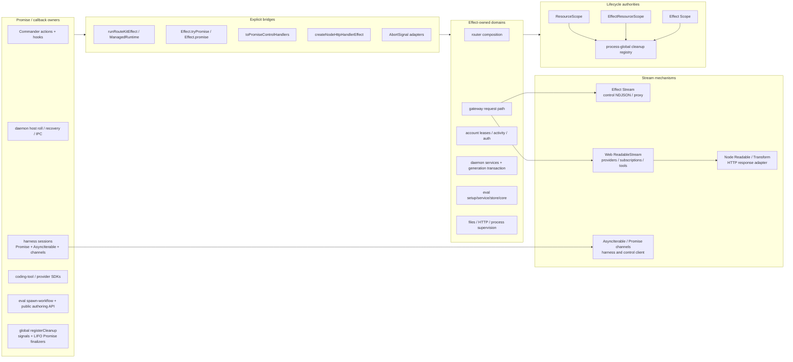

No named `alt-promises`, `AltPromise` or equivalent abstraction exists in this checkout. The competing model is ordinary Promise/async/callback ownership.

Primary migration seams:

- Promise host orchestration contains state/concurrency logic rather than being a thin boundary;
- harness Effect lifecycle is a façade over Promise-owned turn/session controllers;
- global cleanup remains a separate process-wide lifecycle authority;
- streams cross Effect Stream, Web Streams, Node streams and AsyncIterable;
- broad `Error` and catch-all `RouteKitFailure` prevent a closed error algebra;
- process/IPC boundaries often collapse causes to message strings;
- copied eval authoring exposes Promise/JSON and uses `fs/promises`;
- vendored eval contains a separate large Effect service/fiber graph excluded from architecture checks.

Schema and identity fragmentation:

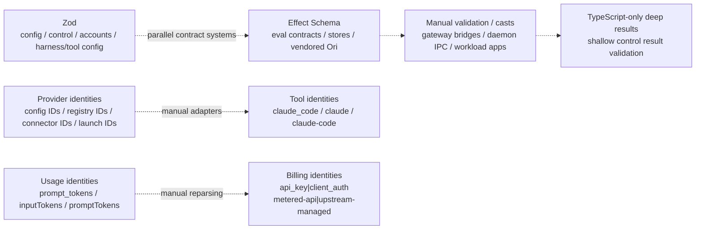

Contract fractures:

- runtime and control duplicate `TokenPlane`, `TokenRole` and token-list projections;
- control duplicates account/reset/usage projections instead of importing one neutral owner;
- accounts structurally mirrors gateway backend, relay, lifecycle and request-option ports to preserve dependency direction;
- `callInspection` manually converts snake-case provenance into camel-case control types;
- error handling mixes tagged errors, coded classes, broad `Error`, stringified IPC errors and catch-all `RouteKitFailure`;
- package root barrels remain broad despite better protocol/routing/effect subpaths;
- `isRecord`/JSON decoding, explicit-model validation and pricing-key logic are repeated across domains.

## 12. State ownership

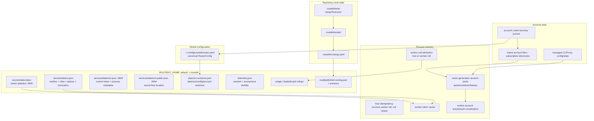

State fractures:

- host and worker are dual writers of `daemon-revisions.json`;
- `host.json` is mode 0600 but non-atomic and unlocked;
- snapshot publication is atomic but only process-locally serialized;
- live call inspection is worker-memory only;
- host idempotency is memory only;
- account opaque seats are process-relative;
- malformed/unsupported `tokens.json` is interpreted as an empty registry and can erase durable admin authority on the next write;
- `readDaemonRevisions` maps corruption/read failure to all-zero revisions;
- telemetry consent, CLI snapshots and some remote repositories independently map malformed state to absence;
- control results and host/worker IPC are only shallowly or type-only validated;
- each subsystem owns separate file format, lock, revision and recovery conventions.

Preferred consolidation: move security/lifecycle state onto the validated `VersionedDocumentStore` policy, distinguish missing from corrupt, and fail closed instead of silently resetting authority.

## 13. Tool and harness flow

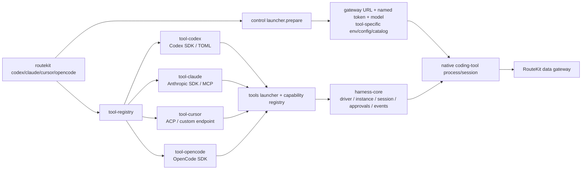

Abstraction boundary:

- dependency rules prevent arbitrary packages from importing concrete `tool-*` adapters;
- `tool-registry` and `tools` own concrete composition;
- `harness-core` public contracts are Promise/AsyncIterable-oriented;
- its Effect lifecycle layer adapts Promise-owned controllers rather than replacing them.

## 14. Remote and AWS operational surfaces

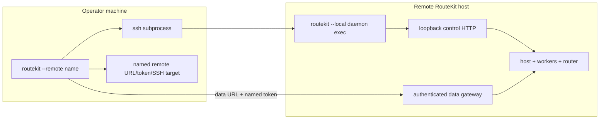

Remote-specific seams:

- `remote add` issues a named data token through SSH control, then stores plaintext in Keychain or a 0600 fallback;
- join credentials encode—not encrypt—an absolute public-record path and durable control secret;
- control-only target resolution currently requires the stored data token even when SSH control authority is still valid;
- remote `models list` and some launcher paths bypass control RPC and read the public data catalog directly;
- the SSH relay buffers one JSON envelope and cannot preserve future long-lived control NDJSON streaming.

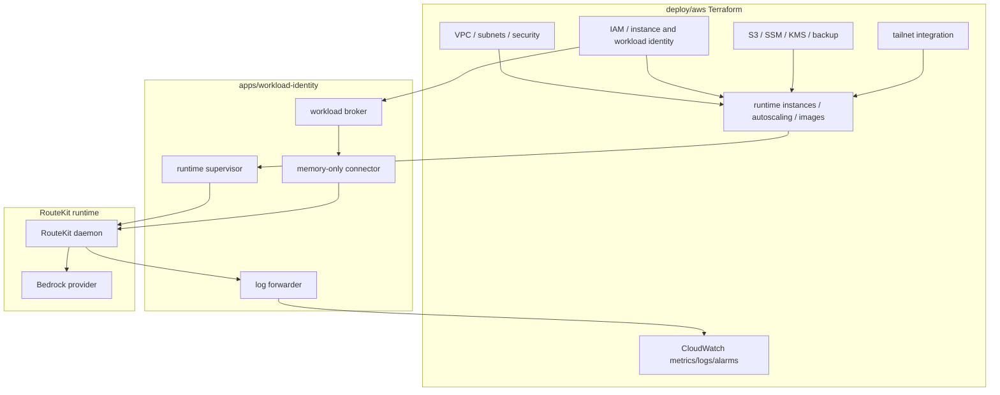

Two AWS deployment generations coexist:

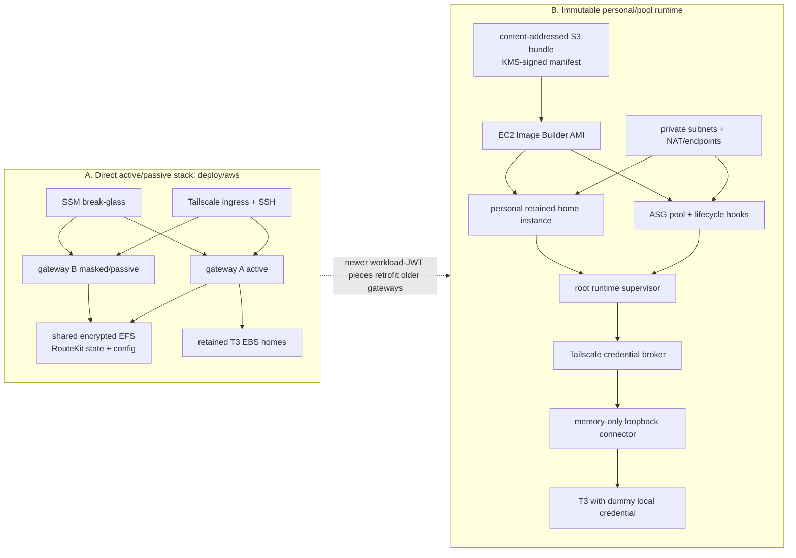

Direct-stack assumptions:

- gateways have public IPs for egress, no EC2 ingress and Tailscale private ingress;
- both gateways mount shared EFS, but no writer lock exists;
- active/passive correctness depends on operator fencing;
- failover scripts resolve an online Tailscale host before starting a stopped target, weakening the documented stopped-passive path.

Immutable-runtime chain:

```mermaid
sequenceDiagram
  autonumber
  participant EC2 as Runtime EC2 role
  participant STS as AWS STS federation
  participant C as Loopback connector :8081
  participant B as Credential broker :8082
  participant KMS as KMS signer
  participant T3 as T3 :3773
  participant RK as External RouteKit gateway

  EC2->>STS: GetWebIdentityToken, 60-second AWS assertion
  C->>B: POST /v1/exchange through Tailscale
  B->>B: verify issuer/audience/account/role/VPC/region/IMDSv2
  B->>KMS: sign 300-second RouteKit JWT
  KMS-->>B: signed JWT
  B-->>C: short-lived gateway authority
  C->>C: cache only in memory
  T3->>C: local request with dummy routekit-workload value
  C->>RK: rewrite with short-lived JWT
```

Ports and boundaries:

- `8080`: stable RouteKit data listener;
- ephemeral loopback: control listener and router generations;
- `8317`: CLIProxyAPI default;
- `8081`: immutable-runtime credential connector;
- `8082`: workload credential broker;
- `3773`: T3 loopback service;
- `443`: Tailscale Serve front door;
- `22`: Tailscale SSH/control relay;
- `2049`: EFS NFS, gateway security group only.

Orbit is not a repository deployment abstraction. `deploy/aws/bin/orbit-bedrock-api-key-put` is an operator bridge with deployment-specific host, region, SSM parameter, local secret source and external sync executable; the corresponding infrastructure is managed elsewhere.

Operational fractures:

- direct/EFS and immutable/runtime-module models overlap without one composed root;
- deployment/activation scripts restart live gateways and rollback to base service rather than necessarily the previous release;
- versions, ports and SSM paths are duplicated across Terraform, builders, manifests and T3 tools;
- declared `secrets_manager`, routing-policy and credential-lifetime fields are not consumed end-to-end;
- the loopback connector has no meaningful local authentication;
- OpenTelemetry exists as a reusable package but production RouteKit does not call `initTracing`;
- direct AWS has only EC2 status alarms, while immutable runtime owns application logs/metrics/dashboard.

Operational-only surfaces:

- `apps/workload-identity`: four service binaries;
- `deploy/aws`: Terraform roots, reusable runtime module, image assets and operator scripts;
- `scripts`: build/release/docs/E2E/remote orchestration;
- `apps/docs`: Next/Fumadocs documentation and generated LLM surfaces;
- `packages/testkit`: provider simulator and eval-routing testdrive;
- these are not covered by the `depcruise packages` success result.

Build, generated artifacts, test, release and docs:

```mermaid
flowchart LR
  Specs["spec/registry/*.json"]
  Generator["scripts/generate-registry.mjs"]
  RegistryData["packages/registry/src/generated/data.ts"]
  Source["packages + apps + scripts"]
  Check["pnpm check<br/>repo invariants / Biome / Effect diagnostics / catalogs"]
  Cruise["pnpm depcruise<br/>packages only"]
  Build["Turbo dependency-first build"]
  Tests["Node tests + provider simulator<br/>E2E matrix / native clients / remote Docker"]
  API["API reports / publint / attw"]
  Changesets["Changesets fixed package group"]
  Publish["npm OIDC publish"]
  Release["GitHub release<br/>SBOM / licenses / installer"]
  DocsGen["command manifests / changelog / llms.txt<br/>TypeDoc on demand"]
  DocsBuild["Next/Fumadocs build"]
  Vercel["staged Vercel validation + promotion"]

  Specs --> Generator --> RegistryData --> Source
  Source --> Check
  Source --> Cruise
  Source --> Build
  Build --> Tests
  Build --> API
  Check --> Changesets
  Tests --> Changesets
  API --> Changesets
  Changesets --> Publish --> Release
  Source --> DocsGen --> DocsBuild --> Vercel
```

Generated/operational artifacts:

- tracked registry data, shell scripts, installer, agent command/error manifests, `llms.txt`, changelog and API reports;
- ignored TypeDoc output, SBOM/licenses, `.artifacts` diagnostics and Terraform state/plans;
- remote Docker E2E proves CLI/SSH/token lifecycle with Verdaccio and a mock provider, not production TLS/Tailscale/AWS/EFS/systemd;
- live eval-routing testdrive uses a detached worktree, isolated HOME/state, egress guard, reservation ledger and final `model:auto` inspection.

## 15. Architecture themes

```mermaid
flowchart TB
  T1["Stable facade, replaceable generations"]
  T1H["Holds: switching proxy, leases, drain, generation transactions"]
  T1B["Breaks: host and router replacement loops use different state/transaction models"]

  T2["Ports before providers"]
  T2H["Holds: Catalog -> Resolver -> Planner -> Executor -> ProviderSource"]
  T2B["Breaks: broad Backend, Bedrock/subscription/CLIProxy special paths"]

  T3["Offline evidence, online policy"]
  T3H["Holds: online path imports snapshots, never eval-engine"]
  T3B["Breaks: gateway imports eval contracts; offline side has two execution stacks"]

  T4["Effect inside, Promise outside"]
  T4H["Holds: explicit runtime/control/process adapters"]
  T4B["Breaks: Promise shells own orchestration, resources and cancellation"]

  T5["Canonical IDs and sanitized provenance"]
  T5H["Holds: provider/model IDs, call ID, route/account/principal inspection"]
  T5B["Breaks: principal header forwarding and process-relative account seats"]

  T6["Filesystem as local database"]
  T6H["Holds: inspectable atomic config/snapshot files and recovery journals"]
  T6B["Breaks: duplicate stores, lock models, writers and revision semantics"]

  T1 --> T1H
  T1 --> T1B
  T2 --> T2H
  T2 --> T2B
  T3 --> T3H
  T3 --> T3B
  T4 --> T4H
  T4 --> T4B
  T5 --> T5H
  T5 --> T5B
  T6 --> T6H
  T6 --> T6B
```

## 16. Ranked fracture map

```mermaid
flowchart TB
  subgraph P0["P0: correctness / ownership"]
    F1["EffectResourceScope disposal<br/>cold Effect can replay finalizers;<br/>custom finalize can run eagerly"]
    F2["daemon-revisions.json dual writer<br/>host can overwrite worker config/account revisions"]
    F3["worker-roll readiness is shared-port<br/>old worker can satisfy candidate checks"]
    F4["interrupted readiness can orphan worker/channel"]
    F5["eval-engine vendored subsystem<br/>shipped but excluded from architecture enforcement"]
    F6["two nested generation mechanisms<br/>host-worker and worker-router"]
    F21["persisted corruption can silently become empty/zero state<br/>tokens / revisions / consent / snapshots"]
    F22["host reservePort is probe-close-rebind<br/>despite a held-port runtime abstraction"]
    F23["active eval integration contracts mismatch<br/>runtime-origin + scratch-path names;<br/>spend/cancellation not enforced"]
  end

  subgraph P1["P1: boundary consolidation"]
    F7["process supervisor delayed SIGKILL<br/>can outlive normal child exit"]
    F8["trusted principal crosses inner gateway<br/>and may be forwarded upstream"]
    F9["two eval execution stacks + legacy stores"]
    F10["eval publication is not one transaction"]
    F11["four lifecycle authorities"]
    F12["control typed product API over generic Promise transport"]
    F13["three stream/cancellation models"]
    F14["CLI depends directly on 19 internal packages"]
    F24["provider/tool/account identity sets drift"]
    F25["two AWS deployment generations coexist"]
    F26["Zod / Effect Schema / manual/type-only validation"]
  end

  subgraph P2["P2: model clarity"]
    F15["wide Backend compatibility interface"]
    F16["online gateway owns eval-domain vocabulary"]
    F17["provider truth split across registry and behavior classes"]
    F18["errors collapse across IPC/process boundaries"]
    F19["long-lived control stream inherits whole-stream timeout"]
    F20["detached fibers and Web Streams have bespoke cancellation"]
    F27["declared tracing + EndpointPipeline are not production-wired"]
  end

  P0 --> P1
  P1 --> P2
```

### P0 evidence and cleanup targets

1. `packages/runtime/src/effect/resource-scope.ts`
   - memoize execution, not a cold finalizer Effect;
   - defer custom finalizers;
   - make disposal idempotent.
2. `packages/daemon/src/host.ts` + `packages/daemon/src/daemon-generations.ts`
   - one owner or locked field-level compare-and-swap for revisions.
3. `packages/daemon/src/host.ts`
   - candidate-specific private readiness endpoint and worker identity.
4. `packages/daemon/src/host-worker-session.ts`
   - cancel-aware acquisition that owns the worker immediately after fork.
5. `packages/eval-engine/package.json` + `.dependency-cruiser.mjs`
   - independent package/graph enforcement or one narrow host SPI.
6. `packages/daemon/src/host.ts` + `packages/daemon/src/daemon-generations.ts`
   - one explicit lifecycle state-machine contract for both generation levels.
7. `packages/runtime/src/tokens.ts` + `packages/daemon/src/daemon-state.ts`
   - validated versioned documents; distinguish missing/corrupt and fail closed.
8. `packages/daemon/src/host.ts` + `packages/runtime/src/runtime-ports.ts`
   - use held-port ownership instead of probe-close-rebind.
9. eval runtime/scratch/spend contracts
   - align environment names, add runtime schema coverage, enforce parent-side spend limits, and propagate cancellation/deadline.

### P1 evidence and cleanup targets

1. `packages/runtime/src/effect/process-supervisor.ts` + `packages/runtime/src/process.ts`
   - cancel escalation on exit and verify process identity.
2. `packages/gateway/src/switching-proxy.ts` + `packages/accounts/src/relay.ts`
   - private request context and explicit upstream header allowlist.
3. `packages/cli/src/effect/eval-cli.ts` + `packages/eval-service/src/service.ts`
   - choose one eval workflow/execution stack and remove inactive stores.
4. `packages/eval-service/src/ori-artifact-promotion.ts`
   - stage all outputs, lock by profile, atomically commit one manifest/pointer.
5. `packages/runtime/src/cleanup.ts` + resource scopes
   - Effect Scope owns internals; one Promise disposable at process/library boundary.
6. `packages/control/src/effect/handlers.ts`
   - Effect-native ControlServer port; generated Promise transport adapter.
7. `packages/gateway/src/model-call-service.ts`
   - one owned stream bridge for cancellation, observation and terminal outcome.
8. `packages/cli/package.json`
   - local-control, tool-launch and eval-workflow application facades.
9. provider/tool/account identity contracts
   - one canonical identity vocabulary with explicit adapters for public launch, registry and connector subsets.
10. `deploy/aws` roots and workload runtime
    - choose or formally compose direct/EFS and immutable/pool deployment models; centralize versions/ports/SSM contracts.
11. control/IPC/eval schemas
    - derive deep TypeScript types from one runtime schema system per boundary.

### P2 evidence and cleanup targets

1. `packages/gateway/src/backend.ts`
   - finish split into discovery, resolution, execution, translation and lifecycle ports.
2. `packages/gateway/src/eval-policy.ts`
   - extract minimal online routing-policy contract; eval compiles into it.
3. `packages/registry/src/generated/data.ts` + provider sources
   - declarative facts in registry; behavior behind one source factory.
4. `packages/runtime/src/effect/errors.ts` + IPC protocols
   - serializable boundary failure envelope with code/retryability/safe detail/cause.
5. `packages/runtime/src/service/control-client.ts`
   - separate connection timeout from inactivity/whole-stream timeout.
6. server-tool, Bedrock and account detached fibers
   - make consumer cancellation directly own iterator/fiber termination.
7. tracing and endpoint pipeline
   - either wire them into the production request path or remove their implied architectural status.

## 17. Dependency rules that currently hold

```mermaid
flowchart TB
  Rules[".dependency-cruiser.mjs"]
  Acyclic["production package code is acyclic"]
  Declared["imports resolve and dependencies are declared"]
  PackageAPI["cross-package imports use package entry points"]
  NoTest["production does not import test code"]
  ToolBoundary["concrete tool adapters compose only through owners"]
  FoundationDown["foundation cannot import application layers"]
  EvalOffline["eval packages cannot import online request path"]
  OnlineNoEngine["online request path cannot import eval-engine"]
  EvalServiceOnly["eval-engine consumed through eval-service"]
  CLIComposition["eval-service consumed through CLI"]
  Layering["gateway/accounts/router/daemon package-layer direction"]

  Rules --> Acyclic
  Rules --> Declared
  Rules --> PackageAPI
  Rules --> NoTest
  Rules --> ToolBoundary
  Rules --> FoundationDown
  Rules --> EvalOffline
  Rules --> OnlineNoEngine
  Rules --> EvalServiceOnly
  Rules --> CLIComposition
  Rules --> Layering
```

The rules prove the checked package import graph is clean. They do not prove:

- runtime ownership is singular;
- resource finalizers are idempotent;
- process cancellation propagates;
- overlapping-worker readiness is candidate-specific;
- file publication is cross-process transactional;
- trusted metadata cannot cross provider boundaries;
- apps/scripts/deploy/vendor architecture is clean;
- active and inactive workflow stacks cannot drift.

## 18. Recommended cleanup order

```mermaid
flowchart LR
  S1["1. Fix correctness hazards<br/>persistence / resource scope / revisions / readiness / eval bridge / process kill"]
  S2["2. Specify process + generation ownership<br/>host / worker / router / proxy / control"]
  S3["3. Collapse eval to one workflow<br/>one store / execution port / publication transaction"]
  S4["4. Normalize boundary adapters<br/>control / streams / errors / cleanup"]
  S5["5. Narrow application and provider facades<br/>CLI / Backend / routing-policy contract"]
  S6["6. Expand architecture enforcement<br/>apps / scripts / deploy / vendored eval"]

  S1 --> S2 --> S3 --> S4 --> S5 --> S6
```

Concrete end state:

- Effect owns internal domain operations, concurrency, cancellation and resources;
- Promise exists once at process/library/SDK boundaries;
- one stream adapter owns Web/Node/Effect cancellation and completion;
- one serializable failure envelope crosses HTTP/IPC/process boundaries;
- one lifecycle state machine defines host-worker and worker-router replacement;
- one eval state machine owns authoring, execution, approval and publication;
- one routing-policy contract belongs to the online routing domain;
- architecture checks cover every shipped graph.
