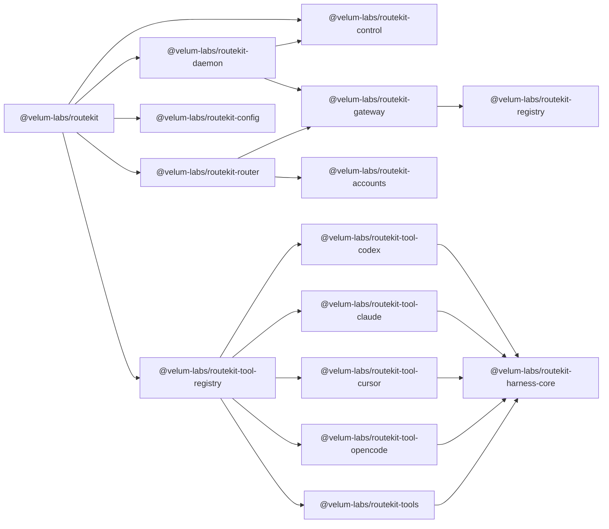

# TypeScript reference

This page documents the TypeScript workspace under `packages/`. It is intended for maintainers who need to find the right package, understand the public exports, and make changes without crossing package boundaries.

The workspace uses ESM, TypeScript project references, pnpm, Node 22 (effectively `>=22.19.0`, since `.npmrc` sets `engine-strict=true` and the pinned `undici` requires it), and package entry points rooted at `packages/<name>/src/index.ts` unless noted otherwise. Tests usually live under `packages/<name>/src/test/` and run after `pnpm build` through the root `pnpm test` command.

## Product package flow



The RouteKit product path starts in `@velum-labs/routekit`. The CLI is a thin client of one singleton daemon per `ROUTEKIT_HOME`. The daemon owns the control listener, OpenAI-compatible gateway, provider discovery, subscription pools, usage, and canonical global config. `@velum-labs/routekit-gateway` owns neutral wire translation, live provider discovery, namespaced model dispatch, and per-call provenance. Coding-tool launchers compose `@velum-labs/routekit-tool-registry` with the daemon gateway URL.

## `@velum-labs/routekit`

`@velum-labs/routekit` publishes the `routekit` binary and is the single user-facing Node entry point. The binary entry file is `packages/cli/src/index.ts`. It imports `buildProgram()` from `packages/cli/src/cli.ts`, prints help on bare invocation, parses the command line, and maps known failures to stable process exits.

`buildProgram()` constructs the Commander tree. It registers lifecycle commands (`start`, `status`, `stop`), provider and account management, model catalog commands, coding-tool launchers, configuration, doctor, telemetry, remote gateways, tokens, completion, and version.

Relevant files:

| File | Responsibility |
| --- | --- |
| `packages/cli/src/index.ts` | Binary entry point, help behavior, top-level error mapping. |
| `packages/cli/src/cli.ts` | Commander program construction and registration order. |
| `packages/cli/src/commands/index.ts` | Command registration and config/target guards. |
| `packages/cli/src/commands/launchers.ts` | Public Codex and Claude Code launchers selected from the internal tool registry. |
| `packages/cli/src/commands/accounts.ts` | Subscription enrollment, listing, and removal. |
| `packages/cli/src/commands/config.ts` | Canonical router config inspection and atomic writes. |
| `packages/cli/src/commands/doctor.ts` | Preflight checks and environment diagnosis. |
| `packages/cli/src/commands/daemon.ts` | Advanced daemon reload, upgrade, logs, and service management. |

Example:

```bash
node packages/cli/dist/index.js --version
node packages/cli/dist/index.js doctor
node packages/cli/dist/index.js config show
node packages/cli/dist/index.js start
node packages/cli/dist/index.js codex openai/gpt-5.5
```

When adding or changing a command, update `docs/cli.md`, add a focused command test if one exists for the command group, and run `pnpm build` before exercising the compiled CLI.

## `@velum-labs/routekit-gateway`

`@velum-labs/routekit-gateway` is the neutral HTTP router. It owns `Backend`, `startGateway()`, Chat/Responses/Anthropic/Cursor dialect adapters, SSE, ACP, single-call cost/provenance records, `RouterConfig`, `CatalogBackend`, provider sources, and OpenAI-compatible, Anthropic, Google GenAI, and Codex Responses egress. Explicitly enabled providers discover models at startup and publish source-qualified `provider/model` IDs.

```ts
import { CatalogBackend, startGateway } from "@velum-labs/routekit-gateway";

const backend = await CatalogBackend.create({
  config: {
    providers: { openai: {} },
    defaultModel: "openai/gpt-5.5"
  }
});
const gateway = await startGateway({ backend });
```

## `@velum-labs/routekit-accounts`

`@velum-labs/routekit-accounts` owns subscription credentials, account sources, quota tracking, multi-account provider pools, per-model eligibility, provider relays, and proxy/client wire contracts. Selection supports sticky, round-robin, and capacity-weighted policies.

## `@velum-labs/routekit-router`

`@velum-labs/routekit-router` composes embedded RouteKit routing: account relays, gateway ownership, and reusable router construction for SDK consumers.

## `@velum-labs/routekit-config`

`@velum-labs/routekit-config` owns `RouterConfig` discovery, layered loading, validation, atomic writes, and live-model selection/assertion helpers used by the CLI and daemon.

## `@velum-labs/routekit-daemon` and `@velum-labs/routekit-control`

`@velum-labs/routekit-daemon` owns the singleton service: a stable cluster host, shared control/data listeners, one rollable daemon worker, router generations, graceful drain, and supervisor integration. `@velum-labs/routekit-control` defines the authenticated `control.v1` RPC surface the CLI uses to manage accounts, config, tokens, usage, call attribution, and local worker rolls.

## `@velum-labs/routekit-contracts`

`@velum-labs/routekit-contracts` holds shared wire and control-protocol types consumed by the CLI, daemon, and gateway packages.

## `@velum-labs/routekit-tools`

`@velum-labs/routekit-tools` defines product-neutral launcher, canonical-driver, and capability metadata. Hosts provide opaque model catalogs and generic agent profiles through `ToolLaunchSpec`.

Important exports are `ToolIntegration`, `ToolLaunchSpec`, `ToolLaunchContext`, `AgentProfile`, `createToolRegistry()`, and `createToolCapabilityMatrix()`.

## `@velum-labs/routekit-tool-registry`

`@velum-labs/routekit-tool-registry` owns the one shipped integration list and exports `toolIntegrations` plus the constructed `toolRegistry`. It depends only on RouteKit's tool contracts and the individual tool packages.

Example:

```ts
import { toolRegistry } from "@velum-labs/routekit-tool-registry";

console.log(toolRegistry.list().map((tool) => tool.id));
```

## Tool packages

`@velum-labs/routekit-tool-codex` owns one Codex serializer/launcher and one SDK driver.

`@velum-labs/routekit-tool-claude` owns one Claude profile serializer/launcher and one Agent SDK driver.

`@velum-labs/routekit-tool-cursor` retains Cursor custom-endpoint setup and one
ACP driver for internal compatibility. It is not a current public support or
launch declaration.

`@velum-labs/routekit-tool-opencode` owns one OpenCode serializer/launcher and
one SDK driver. It is also outside the current public launch contract.

Example:

```ts
import { cursorTool } from "@velum-labs/routekit-tool-cursor";
import { opencodeTool } from "@velum-labs/routekit-tool-opencode";

console.log(cursorTool.driver.kind);
console.log(opencodeTool.capabilities.streaming);
```

## `@velum-labs/routekit-cli-ui` and `@velum-labs/routekit-cli-core`

`@velum-labs/routekit-cli-ui` is a brand-configurable terminal UX layer with rich Ink and ordered plain-text presenters. `@velum-labs/routekit-cli-core` composes it with brand-neutral command context, structured errors, common parsing, completion, version formatting, and test helpers.

Important exports include `createPresenter()`, `InkPresenter`, `PlainPresenter`, prompt helpers (`select()`, `multiselect()`, `confirm()`, `text()`, `fuzzySelect()`), `runWizard()`, `fuzzyFilter()`/`fuzzyMatch()`, and the theme, runtime, and format helpers re-exported from the entry point.

## `@velum-labs/routekit-harness-core`

`@velum-labs/routekit-harness-core` is the product-neutral coding-agent harness contract: driver, instance, and session interfaces, canonical events, tagged errors, approvals, status probes, and shared stream/process primitives.

Important exports include `HARNESS_KINDS`, `isHarnessKind()`, `HarnessError`, `asHarnessError()`, `isRetryable()`, `DEFAULT_AUTOMATION_APPROVAL_POLICY`, `PendingRequests`, stream-JSON helpers, and the `HarnessDriver`/`HarnessInstance`/`SessionHandle` type family.

## RouteKit shared cores

`@velum-labs/routekit-runtime` owns process supervision, child environments, cleanup, atomic files and locks, ports, timeouts, and parameterized portless service registration. `@velum-labs/routekit-config-core` owns layered resolution and validated/migrating JSON IO. `@velum-labs/routekit-telemetry-core` owns parameterized consent, redaction, anonymous event properties, and bounded shutdown.

## `@velum-labs/routekit-registry`

`@velum-labs/routekit-registry` owns provider/auth metadata, catalogs, capabilities, pricing, and discovery helpers generated from `spec/registry/*.json`. Important exports include `REGISTRY`, `PROVIDERS`, and the provider discovery, catalog, capability, and pricing helpers.

## `@velum-labs/routekit-tracing`

`@velum-labs/routekit-tracing` owns the generic OpenTelemetry engine integration: providers, W3C propagation, in-process listeners, and policy-based export redaction.

## `@velum-labs/routekit-testkit`

`@velum-labs/routekit-testkit` (root `packages/testkit`, never published) is the cross-stack E2E tooling described in [Testing](testing.md). It exports `startProviderSim()`, the `DOOR_PROFILES` door axis with `callDoor()`, real-CLI runners (`runClaudeCode()`, `runCodexExec()`, `runOpenCode()`), SSE observation helpers (`parseSse()`, `sseText()`, `sseReasoning()`, `sseDone()`), skip-gating (`detectStackTooling()`, `stackToolingSkip()`, `cliAvailable()`, `cliSkip()`), and process plumbing (`spawnCaptured()`, `waitForHttpReady()`, `freePort()`).

Example:

```ts
import { startProviderSim } from "@velum-labs/routekit-testkit";

const sim = await startProviderSim();
await sim.queue("mock-model", ["hello from the simulator"]);
```

## Change checklist

When changing a TypeScript package, identify whether it is CLI, daemon, gateway, or support infrastructure. Update the nearest docs page for that package, update public exports only when another package needs the symbol, add tests next to the changed source, run `pnpm build`, and run either the focused compiled test or root `pnpm test` when behavior changes.

For generated API reference, run `pnpm docs:generate-code`. Output lands in
gitignored `apps/docs/generated/api/`, is not routed through the public site,
and is not part of `pnpm check`.
